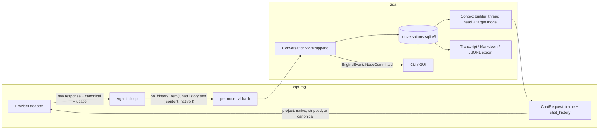
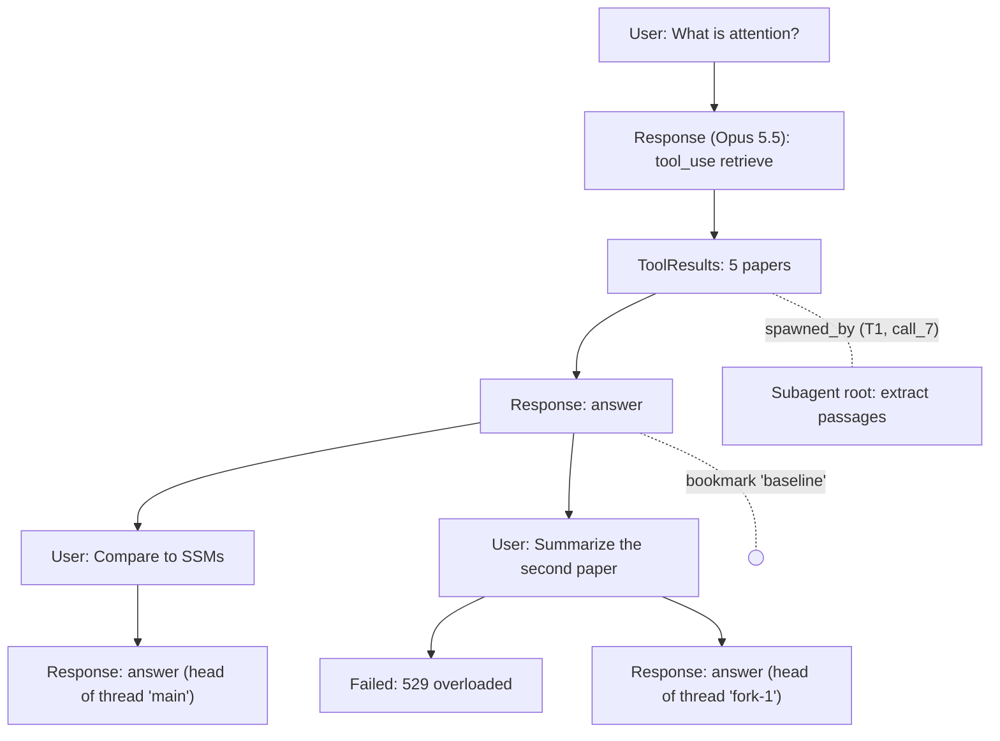

# Design: Conversation Graph Storage

**Linear issues:** ZOT-230, ZOT-231, ZOT-232, ZOT-233, ZOT-234, ZOT-235, ZOT-236  
**GitHub issues:** [#339](https://github.com/zotero-rag/zotero-rag/issues/339) (this doc); implements the storage side of [#336](https://github.com/zotero-rag/zotero-rag/issues/336), [#338](https://github.com/zotero-rag/zotero-rag/issues/338), [#340](https://github.com/zotero-rag/zotero-rag/issues/340), [#341](https://github.com/zotero-rag/zotero-rag/issues/341), [#342](https://github.com/zotero-rag/zotero-rag/issues/342), [#344](https://github.com/zotero-rag/zotero-rag/issues/344)  
**Author(s):** Rahul Yedida + Claude Code (Opus 5.5 xhigh)  
**`master` as of writing:** 7b63a402  
**Date:** 2026-09-24  
**Status:** Approved

## Glossary

- **Node:** An immutable, auto-committed record in a conversation. It is one of: a user message, one provider round trip, a batch of tool results, a compaction summary, or a failed attempt. Every node except a root has exactly one parent.
- **Thread:** A named line of work with a moving **head** node. The thread's history is the path from the root to its head. Forking creates a new thread whose head starts at an existing node.
- **Settled node:** A node under which a new user message may be appended. That means a root, or a model response with no unresolved synchronous tool calls on its path.
- **Session:** A container for threads and the documents they share. A *study session* ([#141](https://github.com/zotero-rag/zotero-rag/issues/141)) has an explicit document selection. A plain `zqa` conversation is a session scoped to the whole library.
- **Bookmark:** A named, fixed pointer to a node, with an optional note ([#341](https://github.com/zotero-rag/zotero-rag/issues/341)). Unlike a thread head, it does not move as the conversation continues.
- **Frame:** What a provider sees before the first message: the rendered system prompt and the tool definitions (name, description, parameter schema).
- **Origin:** The provider, API flavor, and *serving* model that produced a model response. The serving model is the one reported in the response, not the one requested.
- **Native payload:** A provider's response body exactly as returned, stored as JSON.
- **Canonical content:** The provider-agnostic `ChatHistoryContent` view of a message, which exists today.
- **Context builder:** The function that turns a thread and a target model into the frame and history sent to that model.
- **Attempt:** One provider request, recorded with its target, frame, settings, how each history item was replayed, and its outcome.
- **Handoff:** Replaying history to a model that cannot consume some of its native payloads, so those items fall back to canonical content.

## Context and Scope

Conversations are saved as one JSON file per conversation, `$XDG_STATE_HOME/zqa/conversations/conversation_<millis>.json`. Each file holds a flat `Vec<ChatHistoryItem>`, a title, a date, and cumulative usage (`SavedChatHistory` in `crates/zqa/src/state.rs`). That was enough to resume a linear chat with the same model. However, it loses data before anything reaches disk, and it cannot express the features on the roadmap. Specifically:

1. **Native reasoning is dropped after every turn, not only on save** ([#336](https://github.com/zotero-rag/zotero-rag/issues/336)).
   - Inside one `AgenticClient::send_message` call (`crates/zqa-rag/src/llm/base.rs`), the tool loop replays native items: Anthropic `thinking` signatures, OpenAI `encrypted_content`, Gemini `thoughtSignature`, and OpenRouter `reasoning_details`.
   - But `CompletionApiResponse::history_additions` carries only canonical content. Every adapter's `From<ChatHistoryItem>` conversion then drops `ChatHistoryContent::Reasoning`.
   - So the *next live turn* already loses the provider's reasoning state, with no reload involved. A reload only makes the loss permanent.
2. **The typed response structs lose data even inside one call.**
   - The OpenAI adapter keeps only the first text part of an assistant message (`map_message_to_chat_content`) and drops `id`, `annotations`, and `phase`. OpenAI warns that ["Missing or dropped `phase` can cause preambles to be treated as final answers"](https://developers.openai.com/api/docs/guides/reasoning).
   - Anthropic's untagged `AnthropicResponseContent` enum has no variant for blocks that the docs require to be [sent back verbatim](https://platform.claude.com/docs/en/agents-and-tools/tool-use/web-search-tool): server-tool, fallback, and compaction blocks.
   - The same enum requires `signature` on thinking blocks. Ollama's Anthropic-compatible endpoint omits that field (`json:"signature,omitempty"` in [`anthropic/anthropic.go`](https://github.com/ollama/ollama/blob/main/anthropic/anthropic.go)). From reading the source, an Ollama response containing thinking most likely fails to deserialize. This has not been reproduced.
3. **OpenAI responses are silently stored on OpenAI's side.**
   - `store` is never set, so it defaults to `true`. That means ["Response objects are saved for 30 days by default"](https://developers.openai.com/api/docs/guides/conversation-state).
   - Reasoning items are replayed without `encrypted_content`, so they depend on that server-side copy. Community reports (not the docs) say that an expired `rs_...` id fails with "Item with id ... not found".
4. **What is stored is not what was sent, and what is sent changes between turns.**
   - The user turn is stored as the raw query, but the model received `get_summarize_prompt(query)` (`crates/zqa/src/cli/handlers/query.rs`).
   - The system prompt and tools are regenerated from code on every request.
   - The document tools appear only after the first `@import` (`get_user_document_tools` returns nothing until then).
   - The loop removes all tools on its last iteration (`tools_passed = None` in `send_message`).
   - Anthropic's [preserved thinking](https://platform.claude.com/docs/en/build-with-claude/preserved-thinking) binds every thinking block on Opus 5.5 and Fable 5.1 to its prefix: the system prompt, "the set of `tools`", and every earlier message. For accounts created on or after August 31, 2026, "a request that replays an invalidated block is rejected unless you opt into dropping it". The docs say to "Make your integration append-only regardless of your account's age", and to "Persist exactly what you sent and received, and replay that: the rendered system prompt, the tool definitions, and each assistant turn as returned".
   - The same edits also restart the [prompt cache](https://platform.claude.com/docs/en/build-with-claude/prompt-caching) ([#289](https://github.com/zotero-rag/zotero-rag/issues/289)).
5. **Resuming duplicates conversations.**
   - `save_current_conversation` names the file after `Local::now()`, and resuming does not remember the source file. So resume, continue, save writes a second file containing the whole history.
   - The usage in the new file includes the old usage, so summing across files double counts.
6. **Costs lose precision.** `UsageMetadata::estimated_cost` is a `u32` count of US cents. Each query's cost is truncated before it is added, so sub-cent calls (title generation, small models) record zero.
7. **There is no structure for the planned features:** branching, bookmarks, study sessions, model switching, and subagents ([#338](https://github.com/zotero-rag/zotero-rag/issues/338), [#341](https://github.com/zotero-rag/zotero-rag/issues/341), [#342](https://github.com/zotero-rag/zotero-rag/issues/342), [#141](https://github.com/zotero-rag/zotero-rag/issues/141), [#285](https://github.com/zotero-rag/zotero-rag/issues/285), [#259](https://github.com/zotero-rag/zotero-rag/issues/259)). Saving happens on exit (the `dirty` flag), so a crash loses the conversation.

This doc proposes a replacement:

- An append-only **conversation graph** of immutable nodes, stored in SQLite.
- Every model response keeps **both** the provider's native payload and the canonical content.
- Every turn records the **frame** it was sent with.
- Changes to `zqa-rag` so that native payloads survive between turns.
- Per-provider rules for replaying history to the same or a different model.

### Goals and Non-Goals

* **Goals:**
  * **Faithful continuation.** Reloading a thread and continuing it with the same model sends exactly what would have been sent had the process never exited, frame included. That covers provider-opaque reasoning, and it follows each provider's replay guidance (see [Provider replay rules](#provider-replay-rules)).
  * **Append-only, deterministic requests.** Each turn's request extends the previous one and is a pure function of stored data. This keeps preserved thinking valid, and it keeps prompt caches warm within a session and for recent forks. A thread reloaded days later misses the cache once, since provider caches live for minutes to hours.
  * **Model and provider switching** at user-turn boundaries ([#285](https://github.com/zotero-rag/zotero-rag/issues/285)), as a recorded handoff that is visible to the user.
  * **Branching:** fork from any settled node, regenerate a reply, or edit and resubmit a message, without copying history ([#338](https://github.com/zotero-rag/zotero-rag/issues/338), [#342](https://github.com/zotero-rag/zotero-rag/issues/342)).
  * **Bookmarks** on individual message nodes ([#341](https://github.com/zotero-rag/zotero-rag/issues/341)).
  * **Study sessions** whose selected documents are shared by all of their threads ([#141](https://github.com/zotero-rag/zotero-rag/issues/141)).
  * **Subagent transcripts** linked to the tool call that spawned them ([#259](https://github.com/zotero-rag/zotero-rag/issues/259)).
  * **Crash safety.** Every node is committed as soon as it exists. Loading a conversation never executes a tool.
  * **Concurrency without lost writes**, both for concurrent conversations in one process (the GUI) and for the CLI and GUI open at the same time ([#344](https://github.com/zotero-rag/zotero-rag/issues/344)).
  * **Lossless import/export and a readable Markdown export** ([#173](https://github.com/zotero-rag/zotero-rag/issues/173), [#271](https://github.com/zotero-rag/zotero-rag/issues/271)).
  * **Migration** of existing JSON conversations without inventing data they never had.

* **Non-Goals:**
  * **Server-side conversation state.** This covers OpenAI [`previous_response_id` and Conversations](https://developers.openai.com/api/docs/guides/conversation-state) and the Gemini [Interactions API](https://ai.google.dev/gemini-api/docs/interactions-overview). These tie a conversation to one provider and to its retention window (30 days for stored OpenAI responses, 1 to 55 days for Interactions). They can never be the source of truth.
  * **Server mode and multi-user storage** ([#311](https://github.com/zotero-rag/zotero-rag/issues/311)). One local host owns the database. Worker ownership, fencing, and owner columns are deferred. Adding a column later is a cheap `ALTER TABLE`.
  * **A context-window strategy.** This doc provides compaction *nodes* and the rule that context policies must follow. It does not decide when or how to compact.
  * **Semantic search over past conversations.** A LanceDB index over node text can be added later without schema changes.
  * **Editing nodes in place.** "Editing" a message creates a sibling node.

## Summary of Decisions

| # | Decision | Choice | Why |
| --- | --- | --- | --- |
| 1 | Model used when a thread is resumed | **The thread's last model.** The configured model is used for new threads, and `/model` switches explicitly. | Keeps native reasoning and cache affinity. Switching models only when the user asks keeps handoffs rare and visible. |
| 2 | What old threads do after an upgrade changes the system prompt or tools | **Keep the thread's stored frame** | Only Anthropic documents a way to change instructions and tools without editing the prefix ([mid-conversation system messages](https://platform.claude.com/docs/en/build-with-claude/mid-conversation-system-messages)); it is not available on Sonnet 5, and tool changes are in beta. OpenAI's path is partial: [developer messages](https://developers.openai.com/api/docs/guides/text), plus [`allowed_tools`](https://developers.openai.com/api/docs/guides/function-calling), which can only *restrict* declared tools. Gemini `generateContent` treats [system instructions](https://ai.google.dev/gemini-api/docs/generate-content/text-generation) and tools as request-level config with no mid-conversation equivalent. OpenRouter and Ollama document nothing similar. Revisit if all providers gain a documented path. |
| 3 | Reasoning from a model that cannot read it natively | **Convert it to plain text on a best-effort basis** (non-empty summaries only; redacted or encrypted reasoning is dropped) | This matches [pi's `transformMessages`](https://github.com/earendil-works/pi/blob/main/packages/ai/src/api/transform-messages.ts) and [opencode's `message-v2.ts`](https://github.com/anomalyco/opencode/blob/dev/packages/opencode/src/session/message-v2.ts). Today's adapters drop reasoning instead, so this is a change. |
| 4 | Deployment model | **One local host.** No worker ownership or fencing. | Server mode is not planned. |
| 5 | When nodes are committed | **As each node is produced, from Phase 1**, with "interrupted" state detected on load | Web search ([#250](https://github.com/zotero-rag/zotero-rag/issues/250)) is a few months out and paper import ([#252](https://github.com/zotero-rag/zotero-rag/issues/252)) further out. Committing per node is cheap now and gives record-before-execute semantics before side-effectful tools arrive. |
| 6 | Anthropic prefix-binding fixes | **Apply them regardless of account age** | The docs recommend append-only integrations for all accounts. |
| 7 | Primary store | **SQLite** (`rusqlite` is already a dependency of `zqa`), with JSONL for export | See [Rejected Alternatives](#rejected-alternatives). |

## Design

### Overview

Storage is lossless, and every view is derived from it.

- Everything that happened is recorded exactly once, as immutable nodes.
- What the model sees comes from the context builder. What the user sees comes from transcript rendering over canonical content. Costs come from a usage ledger.
- Some inputs are not a pure function of the nodes: the frame, the rendered user prompt, and compaction summaries. Each of these is stored when it is first produced, so it is computed once and replayed identically afterwards.



The following example shows one study session, with a fork, a regenerated reply, a failed attempt, and a subagent run:



The work is split into three parts:

1. **`zqa-rag`: native payloads, explicit frames, and replay rules.** This part is small and ships on its own; with the existing JSON files it already fixes #336.
2. **`zqa`: the conversation graph.** Nodes, threads, sessions, bookmarks, frames, attempts, the usage ledger, the context builder, and auto-commit.
3. **Front-ends: cursor movement, tree navigation, and events.** Only sketched here; the UX belongs to #342 and #343.

### Part 1: `zqa-rag`

#### Native payloads

`ChatHistoryItem` gains an optional native payload:

```rust
pub struct ChatHistoryItem {
    pub role: MessageRole,
    pub content: Vec<ChatHistoryContent>,           // canonical, unchanged
    #[serde(default, skip_serializing_if = "Option::is_none")]
    pub native: Option<NativePayload>,
}

pub struct NativePayload {
    /// Provider, API flavor (e.g. "anthropic.messages", "openai.responses"), and the serving
    /// model reported by the response.
    pub origin: ModelRef,
    /// Hash of the frame the request was sent with.
    pub frame: FrameHash,
    /// The response body exactly as returned.
    pub response: serde_json::Value,
}
```

- **What gets captured.** The loop attaches `native` to every assistant item it produces. User and tool-result items are constructed locally and never need it.
- **Capture the raw body, not the typed structs.** `send_generation_request` already parses the body into a `serde_json::Value` before converting it to the typed structs, so the raw body is available.
  - Capturing it makes storage **forward-compatible by construction**. Item types we don't model yet are stored anyway: OpenAI `program`, `compaction`, and `configuration_update`; Anthropic `server_tool_use`, `fallback`, and `compaction`.
  - It also keeps response-level fields that affect continuation, such as Anthropic's `container`.
- **Storing is not the same as resending.** Each adapter *projects* the stored response into valid request input. By default it keeps every field and block in its original order, and it removes only fields the adapter knows are output-only; the OpenAI Agents SDK, for example, [strips output-only `created_by` metadata](https://openai.github.io/openai-agents-python/results/) before replay. It never writes absent fields as `null`, which Anthropic rejects with "Extra inputs are not permitted".
- **One projection path.** The in-loop history is built with the same projection, so in-loop replay and reload replay are identical. Each adapter's native history type gains a verbatim passthrough variant (for example, `Raw(serde_json::Value)`).
- **Choosing native or canonical.** `build_initial_history(&self, request)` replaces the blanket `From<ChatHistoryItem>` conversions for assistant items. It already has `&self`, so it knows the target model. For each item, it calls the adapter's `replay(&native, &request.frame)`, which returns one of three things:
  - native items;
  - native items with reasoning stripped;
  - a canonical fallback.
- **What the canonical fallback does.** Text, tool calls, and tool results convert as they do today. On top of that:
  - Non-empty reasoning summaries become plain text blocks in their original position (Decision 3).
  - Tool-call IDs are sanitized deterministically where a provider constrains them. OpenAI Responses IDs can be [450+ characters](https://github.com/earendil-works/pi/blob/main/packages/ai/src/api/transform-messages.ts), while Anthropic requires `^[a-zA-Z0-9_-]{1,64}$`.
  - The rendering must be deterministic, because it becomes part of the prefix on the new provider.
- **Returning results.** `ChatRequest.chat_history` keeps its type. Items are also delivered through a new `on_history_item` callback as each one is produced, in addition to the final `history_additions`, so `zqa` can commit per node (Decision 5). Old JSON files deserialize with `native: None` and behave exactly as they do today.

#### Frames

The system prompt and tool definitions are passed as an explicit `Frame { system_prompt, tools: Vec<ToolSpec> }`, where `ToolSpec` is `{ name, description, parameters }`.

- **Hashing.** `FrameHash` is an `xxh3` hash of the provider-agnostic frame; `xxhash-rust` is already a dependency. The adapter still serializes the frame into its own format, including its schema key.
- **Stored tool specs, current implementations.** Stored specs are paired with current `Tool` implementations by name, using a small wrapper in `zqa` that overrides `description` and `parameters`. The `Tool` trait does not change.
- **Stored frames never grant permission.** Execution always checks the current tool policy, including the `tools: None` rule for document-processing subagents from [#302](https://github.com/zotero-rag/zotero-rag/issues/302). A frozen tool that has since been removed or disallowed returns an error result.

#### Disabling tools without changing the frame

On the final iteration, the loop keeps `tools` and sets a "no tool calls" choice instead of removing them:

| Provider | "No tool calls" setting |
| --- | --- |
| Anthropic | `tool_choice: {"type": "none"}`. The docs say: "To turn tool use off for a request, send `tool_choice: {"type": "none"}`. Don't remove `tools`." `tool_choice` is outside the prefix check. |
| OpenAI | `tool_choice: "none"` |
| Gemini | [`function_calling_config.mode: NONE`](https://ai.google.dev/gemini-api/docs/generate-content/function-calling) |
| OpenRouter | [`tool_choice: "none"`](https://openrouter.ai/docs/api/reference/parameters) |
| Ollama | Tools are still removed. [`tool_choice` is unsupported](https://docs.ollama.com/api/anthropic-compatibility), and Ollama has no prefix binding. |

#### Smaller changes

- `ReasoningConfig` derives `Serialize`/`Deserialize`, since it is recorded per turn.
- `ToolCallResponse` gains `is_error: bool` (`#[serde(default)]`). Adapters map it where the provider supports it; Anthropic, for example, has [`is_error`](https://platform.claude.com/docs/en/agents-and-tools/tool-use/handle-tool-calls).
- The OpenAI adapter sends `store: false` and `include: ["reasoning.encrypted_content"]`. The `include` is legacy under `store: false`, but it is harmless.
- The Anthropic adapter enables [automatic prompt caching](https://platform.claude.com/docs/en/build-with-claude/prompt-caching) with a top-level `cache_control: {"type": "ephemeral"}`. This is a small start on #289 that pays off once requests are append-only.
- On a prefix-mismatch 400, the Anthropic adapter retries once with `thinking.block_binding.prefix_mismatch_behavior: "drop_block"`, and records that choice on the thread. With a deterministic builder this should not happen, so it is only a safety net.
- The OpenRouter adapter sends the session ID as `session_id`, so [sticky routing](https://openrouter.ai/docs/guides/best-practices/prompt-caching) keeps a thread on one upstream provider, where its cache lives.

### Part 2: The conversation graph in `zqa`

#### Nodes

A node is one row of `nodes`. Its body is a versioned, tagged serde enum. The payloads reuse `ChatHistoryItem`, so a single message type is used all the way from the provider adapters to disk.

```rust
enum NodeBody {
    /// A user message exactly as sent (e.g. the rendered summarize prompt), what to display,
    /// and the settings the turn ran with.
    User { message: ChatHistoryItem, display: Option<String>, turn: TurnContext },
    /// One provider round trip; `message.native` holds the raw response and origin.
    Response { message: ChatHistoryItem },
    /// Results for tool calls on the path, with UI-only provenance and subagent links.
    ToolResults { message: ChatHistoryItem, provenance: Vec<SourceRef>, subagents: Vec<SubagentLink> },
    /// A summary that stands in for everything on the path up to and including `covers`.
    Compaction { summary: ChatHistoryItem, covers: NodeId },
    /// A failed, refused, or cancelled attempt. Shown in the tree; never sent to a model.
    Failed { error: String, partial: Vec<ChatHistoryContent> },
}

struct TurnContext {
    model: ModelRef,
    reasoning: Option<ReasoningConfig>,
    frame: FrameHash,             // key into the content-addressed `frames` table
    scope_revision: u32,          // which revision of the session's document scope was in effect
    imports: Vec<DocumentRef>,    // documents imported by this message (@mentions)
}
```

- **One node per provider message**, the same granularity as `history_additions` today.
  - This is what lets users bookmark individual messages.
  - Steering injections ([#315](https://github.com/zotero-rag/zotero-rag/issues/315)) and late async tool results ([#353](https://github.com/zotero-rag/zotero-rag/issues/353)) fit without special cases.
  - An Anthropic `pause_turn` continuation, which is ["sent back as-is"](https://platform.claude.com/docs/en/build-with-claude/handling-stop-reasons), is simply another `Response` node.
- **Store what was sent.** `User.message` is the rendered prompt, and `display` is the raw query shown to the user. Changing `get_summarize_prompt` later affects only new turns.
- **Turn context lives on the user node.**
  - The settings in effect at any node are read off the user nodes on its path, so checking out an old node restores the settings that produced it.
  - This is the same idea as Codex's per-turn [`TurnContext`](https://github.com/openai/codex/blob/main/codex-rs/history/src/lib.rs) and pi's [`model_change`/`thinking_level_change` entries](https://github.com/earendil-works/pi/blob/main/packages/coding-agent/docs/session-format.md), but it needs no extra node kinds.
- **Provenance stays out of the model context.**
  - `ToolResults.provenance` records what the tools found, for the GUI and for export citations: Zotero item and attachment keys, chunk or page, a content hash, and score.
  - It is never sent to a model, just as Claude Code keeps `toolUseResult` beside the `tool_result` the model sees.
  - The model-visible passages themselves are stored in full as the tool result. A bare reference into a mutable LanceDB index would not be enough for a follow-up like "tell me more about the second paper" ([#303](https://github.com/zotero-rag/zotero-rag/issues/303)).

#### Frames over a thread's lifetime

- **Capture and reuse.** A thread's frame is captured on its first turn and reused by every later turn (Decision 2).
  - This requires the document tools to be registered from the first turn, with `list_documents` returning an empty list until an import happens.
  - It also requires study-session scope to reach the model through tool behaviour (retrieval filters by the current scope), not through the system prompt.
- **Refreshing a frame.** A frame changes only when the user explicitly refreshes a thread (see [Open Questions](#open-questions)).
  - The next user node then records the new hash.
  - The Anthropic adapter drops thinking bound to the old frame. This is allowed: removing thinking "from the start" is fine, while leaving a gap is not.
  - The cost is one cache miss and the older thinking.

#### Threads, heads, and forks

- **What a thread is.** A thread is a row with `head_node_id`, `forked_from_node_id`, a title, its last `ModelRef` (Decision 1), and flags, such as the Anthropic `drop_block` choice.
- **How the head moves.**
  - The head advances only to settled nodes.
  - A running turn keeps its in-progress position in memory.
  - When the turn succeeds, the head is saved as the last `Response` node.
- **Forking.** Forking creates a new thread whose head is an existing settled node. Nothing is copied, and IDs never change.
  - Copying has caused real bugs elsewhere. Remapping Claude Code transcript UUIDs [left stale `compactMetadata` references that broke compacted sessions](https://github.com/getpaseo/paseo/issues/3837). opencode's `Session.fork` has to remap `tail_start_id` by hand. Codex moved to fork-by-reference ([`history_base`](https://github.com/openai/codex/blob/main/codex-rs/rollout/src/rollout_reference_index.rs), [`revert_thread.rs`](https://github.com/openai/codex/blob/main/codex-rs/thread-store/src/local/revert_thread.rs)).
- **Regenerating and editing.**
  - "Regenerate" is a fork at the user node, whose new `Response` becomes a sibling of the old one.
  - "Edit and resubmit" is a fork at the parent of the user node.
- **Deriving the tree.** Children always come from an index on `parent_id` and are never stored as lists. In Open WebUI, stored `childrenIds` [were not persisted, so later turns disappeared after a reload](https://github.com/open-webui/open-webui/issues/29299).
- **Validating heads.** A thread's head is validated when the thread is loaded. A dangling `currentId` [left Open WebUI stuck loading](https://github.com/open-webui/open-webui/issues/24157).

#### Settled nodes, failures, and interruptions

- **Settled nodes.** A user message may only be appended under a settled node.
  - This rule is structural, so no fork can produce a `tool_use` without a `tool_result`. pi needs [synthetic "No result provided" results](https://github.com/earendil-works/pi/blob/main/packages/ai/src/api/transform-messages.ts) for that case; this design never does.
  - [Async tool calls](https://developers.openai.com/api/docs/guides/async-tool-calling) (#353) are deliberately left pending, since their outputs arrive later on the original `call_id`. They are part of the path's state (async calls without outputs) and do not block settling.
- **Failed turns become dead branches.**
  - A turn commits its user node before the request is sent.
  - On an error, a cancellation, or a refusal, a `Failed` node records the error and any partial output. Anthropic says to ["treat any partial output as incomplete"](https://platform.claude.com/docs/en/build-with-claude/refusals-and-fallback) after `refusal`, and `model_context_window_exceeded` is handled the same way.
  - The head does not move, so the attempt remains a visible branch for inspection or retry.
  - Nothing is deleted; the context builder skips `Failed` nodes. opencode had an error where [dropping reasoning on errored turns while replaying their tool calls](https://github.com/anomalyco/opencode/pull/44054) produced 400s.
- **Crash recovery.** A crash mid-turn leaves nodes past the saved head, with no `Failed` node.
  - On load, such a branch is shown as *interrupted*. An unanswered tool call there has an *unknown outcome*.
  - Loading never executes anything. The user can retry, which forks from the head, and nothing is re-run automatically. This matters once side-effectful tools such as paper import (#252) exist.
  - A request that lost its connection may still have cost money or run provider-hosted tools, so its attempt is recorded as `unknown`, not `failed`.

#### Sessions and study sessions

- **What a session holds.** A session owns threads and a **document scope**: `Library`, or a revisioned list of `DocumentRef`s for study sessions (#141).
  - `/new` creates a session.
  - "New thread in this study session" creates a thread with a new root in the same session.
  - A session with a single thread is today's "conversation".
- **Scope is live.** Every thread uses the session's current scope, as #338 describes. Each user node records the scope revision it ran with, so history remains auditable (see [Open Questions](#open-questions)).
- **Document references.** A `DocumentRef` is a Zotero item or attachment key, or a file path plus content hash for `@imports`. Parsed text for imports is cached in the state directory by hash, not stored in the conversation database.

#### Bookmarks

A bookmark maps `(session_id, name)` to `node_id`, plus a note. It lives in its own table and never moves with a thread.

pi instead stores labels as tree entries, so [its `createBranchedSession` has to strip them and re-chain the path](https://github.com/earendil-works/pi/blob/main/packages/coding-agent/src/core/session-manager.ts). Keeping bookmarks out of the tree avoids that.

#### Subagents

A subagent run is its own thread with its own root in the same session. It records:

- `spawned_by = (node_id, tool_call_id)`;
- the frozen initial frame and scope revision;
- the model and the permitted tools.

The parent's `ToolResults` node lists its links, and the subagent's final answer reaches the parent only as that tool result. The same pattern appears in Claude Code (`subagents/agent-<id>.jsonl` with a `toolUseId` link), Codex ([`thread_spawn_edges`](https://github.com/openai/codex/blob/main/codex-rs/state/migrations/0021_thread_spawn_edges.sql)), and opencode (child sessions via `parent_id`).

- **Visibility.** Subagent threads are hidden from the main sidebar but can be opened, continued, or exported.
- **Persistence.** Each tool decides whether its transcript is persisted:
  - The research agent (#259) persists full transcripts.
  - The summarization and extraction subagents persist only their output (already the tool result) and their usage, because their inputs are whole papers that can be rebuilt from the library.

#### Context builder

```text
build_context(head, target) -> (Frame, Vec<ChatHistoryItem>, ReplayReport):
    path  = ancestors(head), from the nearest Compaction node (inclusive) to head
    frame = frames[last User node on path .turn.frame]
    items = for node in path:
        User / Response / ToolResults -> node.message
        Compaction                    -> node.summary
        Failed                        -> skipped
    // zqa-rag projects each item: native, native minus reasoning, or canonical (+ reasoning as text)
    return (frame, items, report of how each item was replayed)
```

- **Properties.** The builder is pure and deterministic, it ignores nodes off the path, and its output only ever extends from turn to turn. The replay report goes into the attempt record.
- **Handoffs.** When an item replays canonically because the model or provider changed, the engine emits one visible notice per switch. For example: "Switched from Opus 5.5 to GPT-5.6: earlier reasoning is sent as plain text; provider-specific state such as web search results is not carried over."
- **Context policies.** A context policy (for example, trimming old tool payloads for #303) can be added later, but it must be *stable*: once a prefix has been sent, later turns send the same prefix.
  - A policy whose output changes as the thread grows, such as "hide tool results older than K turns", would invalidate preserved thinking and move the cache boundary on every turn.
  - Such a policy must instead write a `Compaction` node. That matches pi's model: [compaction as an entry that never deletes anything and applies only to its branch](https://github.com/earendil-works/pi/blob/main/packages/coding-agent/docs/compaction.md).
  - Unlike Claude Code's compaction boundaries, which [set `parentUuid: null`](https://github.com/Sertelegger/claude-sesh-mover/issues/129), a `Compaction` node keeps the parent chain intact.
  - Provider-native compaction produces payloads that are stored in the node's `summary.native` and replayed as-is: Anthropic [`compaction` blocks](https://platform.claude.com/docs/en/build-with-claude/compaction) and OpenAI [`compaction` items](https://developers.openai.com/api/docs/guides/compaction).

#### Write path

1. **The user submits.** Store the frame if it is new, record an attempt (`running`), commit a `User` node under the head, and send the request.
2. **Each `on_history_item` commits a node.** A `Response` node is committed before its tool calls execute, so it is the record of intent. A `ToolResults` node is committed before the next request is built. Each commit also records usage.
3. **Success:** save the head as the last `Response` node and mark the attempt `ok`.
4. **Error, cancellation, or refusal:** commit a `Failed` node and mark the attempt `failed` or `cancelled`. If the connection dropped, mark it `unknown`.
5. **Notify front-ends.** Every commit emits `EngineEvent::NodeCommitted { session, thread, node, parent }`. The GUI sidebar (#343) consumes it, and the CLI ignores it.

Streamed tokens are never persisted. Only complete provider responses become nodes. The `dirty` flag, `save_current_conversation`, and save-on-`/new`/`/quit` all go away. Resuming does not copy anything: it only loads a thread.

### Provider replay rules

Each adapter implements these rules in `replay`. They are pure functions and are unit-tested per provider. "Canonical" means: text, tool calls, and tool results; non-empty reasoning summaries as plain text; sanitized IDs.

| Provider | Same provider and API, same model | Same provider and API, different model | Frame changed since the item | Different provider or API |
| --- | --- | --- | --- | --- |
| **Anthropic** | Native, verbatim. This includes empty `thinking`, `redacted_thinking`, citations, and server-tool blocks with their `encrypted_content`. ["Required: within a tool-use turn, pass thinking blocks back"](https://platform.claude.com/docs/en/build-with-claude/thinking); recommended across turns. | Native, verbatim. ["Keep passing thinking blocks back unchanged when you switch models ... the API ignores or drops the blocks the target model can't read."](https://platform.claude.com/docs/en/build-with-claude/thinking) Reasoning is ["lost for good only if your client removes the blocks itself"](https://platform.claude.com/docs/en/build-with-claude/preserved-thinking). | Strip thinking produced under older frames. | Canonical. Per the docs, other models' turns are sent ["as `text` and `tool_use` content"](https://platform.claude.com/docs/en/build-with-claude/preserved-thinking). |
| **OpenAI (Responses)** | Native, verbatim. Reasoning keeps `id` and `encrypted_content`; messages keep `id`, `phase`, and `annotations`; calls keep `caller`. Replay reasoning ["since the last `user` message"](https://developers.openai.com/api/docs/guides/reasoning) at minimum. GPT-5.6 also uses earlier turns ([`reasoning.context`](https://developers.openai.com/api/docs/guides/upgrading-to-gpt-5p6-sol)). | Native, verbatim. ["When you switch model families, the API omits incompatible reasoning from the model's context"](https://developers.openai.com/api/docs/guides/reasoning). | No change: reasoning is not bound to instructions or tools. | Canonical. |
| **Gemini (`generateContent`)** | Native, verbatim: exact part order and grouping. Signature-only parts are sent as `{"text": "", "thoughtSignature": ...}`, since omitting `text` [causes intermittent 400s](https://github.com/google/adk-go/issues/1633). Gemini 3.5+ ["uses reasoning context from all previous turns when thought signatures are present"](https://ai.google.dev/gemini-api/docs/whats-new-gemini-3.5). | Canonical. Only the [current turn is validated](https://ai.google.dev/gemini-api/docs/generate-content/thought-signatures), and partial foreign context can hurt quality. | No change. | Canonical. For a function call in the *current* turn that has no signature (an injected or steered trace), use the [documented `skip_thought_signature_validator`](https://ai.google.dev/gemini-api/docs/generate-content/thought-signatures) as a last resort. |
| **OpenRouter** | Native, verbatim: `reasoning_details` unmodified and in order (["you cannot rearrange or modify the sequence"](https://openrouter.ai/docs/guides/best-practices/reasoning-tokens)). DeepSeek with tools [requires `reasoning_content` in all later requests](https://api-docs.deepseek.com/guides/thinking_mode). | Canonical. Behaviour across `format`s is undocumented. | No change. OpenRouter does not enforce Anthropic prefix binding. | Canonical. |
| **Ollama (Anthropic-compatible)** | Native, verbatim. Thinking blocks carry no signature, and the [chat template decides](https://docs.ollama.com/capabilities/tool-calling) whether earlier thinking is used. | Canonical. | No change. | Canonical. |

Notes:

- **Matching requires the API flavor as well as the provider**, as in pi's `isSameModel`. Google now [recommends the Interactions API](https://ai.google.dev/gemini-api/docs/interactions-overview) over `generateContent`. If the Gemini adapter ever moves to Interactions, old payloads fall back to canonical instead of being misread.
- **Switching back.** Switching back to a model that can read earlier native payloads restores them. Anthropic documents this: "When the same history goes back to Claude Fable 5.1, its blocks are readable again."
- **Container and pause limits.** [Anthropic containers expire 30 days after creation](https://platform.claude.com/docs/en/agents-and-tools/tool-use/code-execution-tool), and a [pending programmatic tool call times out after about 4 minutes](https://platform.claude.com/docs/en/agents-and-tools/tool-use/programmatic-tool-calling). A thread resumed later sends no expired `container` and treats paused programmatic calls as interrupted.

### APIs

`zqa` owns persistence. `zqa-rag` stays storage-agnostic and exposes only `NativePayload`, `Frame`/`ToolSpec`, the `on_history_item` callback, and the replay rules.

`rusqlite` is synchronous, so store calls go through `spawn_blocking` or a dedicated store thread. Transactions are short, and none is ever held across a network request or tool execution.

```rust
impl ConversationStore {
    fn open(path: &Path) -> Result<Self, StoreError>;        // WAL, busy_timeout, migrations
    fn open_in_memory() -> Result<Self, StoreError>;          // tests: no #[serial], no ZQA_STATE_DIR
    fn create_session(&self, scope: DocumentScope) -> Result<SessionId, StoreError>;
    fn create_thread(&self, session: SessionId, from: Option<NodeId>, model: ModelRef)
        -> Result<ThreadId, StoreError>;
    fn append(&self, thread: ThreadId, parent: Option<NodeId>, body: NodeBody)
        -> Result<NodeId, StoreError>;
    fn set_head(&self, thread: ThreadId, node: NodeId) -> Result<(), StoreError>;
    fn path(&self, head: NodeId) -> Result<Vec<Node>, StoreError>;          // root..=head
    fn tree(&self, session: SessionId) -> Result<Vec<NodeSummary>, StoreError>;
    fn sessions(&self) -> Result<Vec<SessionSummary>, StoreError>;           // /resume, sidebar
    fn put_frame(&self, frame: &Frame) -> Result<FrameHash, StoreError>;
    fn record_attempt(&self, attempt: &Attempt) -> Result<AttemptId, StoreError>;
    fn record_usage(&self, usage: &UsageRecord) -> Result<(), StoreError>;
    fn set_bookmark(&self, session: SessionId, name: &str, node: NodeId, note: Option<&str>)
        -> Result<(), StoreError>;
    fn export_jsonl(&self, session: SessionId, out: impl Write) -> Result<(), StoreError>;
    fn import_jsonl(&self, input: impl BufRead) -> Result<SessionId, StoreError>;
}
```

Changes to `Context` and the front-ends:

- **State.** `State.chat_history`, `title`, `dirty`, and `usage` are replaced by the current `SessionId` and `ThreadId`.
- **The store in `Context`.** `Context` gains the store, and its path goes into `PathOptions`, following the existing test-isolation pattern for LanceDB and the batch file.
- **Embedding API and GUI.** The embeddable `Session` and the GUI bridge exchange IDs (`ResumeThread(ThreadId)`, `Checkout(NodeId)`) instead of cloned `SavedChatHistory` values.
- **CLI commands.** The CLI gains `/tree`, `/checkout <bookmark|id-prefix>`, `/bookmark <name>`, `/fork`, and `/model`, and `/resume` lists sessions and threads. The exact UX is left to #342, #285, and #343.

### Data Storage

The database is a single SQLite file at `$XDG_STATE_HOME/zqa/conversations.sqlite3`, opened with `journal_mode=WAL`, `foreign_keys=ON`, `synchronous=FULL`, and a busy timeout. Schema outline:

```sql
sessions  (id TEXT PK /* UUIDv7 */, title, scope TEXT /* JSON */, scope_revision INTEGER,
           created_at, updated_at)
threads   (id TEXT PK, session_id, head_node_id, forked_from_node_id NULL,
           spawned_by_node_id NULL, spawned_by_call_id NULL,   -- subagent threads only
           title NULL, model TEXT /* JSON ModelRef */, flags TEXT /* JSON */, created_at, updated_at)
nodes     (id TEXT PK /* UUIDv7: time-ordered, globally unique, safe to import/merge */,
           session_id, parent_id NULL, kind TEXT, provider NULL, api NULL, model NULL,
           created_at, body TEXT /* JSON NodeBody with "v" */)
           INDEX (parent_id), INDEX (session_id, created_at)
frames    (hash TEXT PK, body TEXT)                               -- system prompt + tool specs
attempts  (id INTEGER PK, thread_id, user_node_id, response_node_id NULL,
           provider, api, requested_model, served_model NULL, adapter_version,
           frame_hash, settings TEXT, replay_report TEXT, input_digest TEXT,
           outcome TEXT /* running|ok|failed|cancelled|unknown */, error NULL,
           started_at, finished_at NULL)
bookmarks (session_id, name, node_id, note NULL, created_at, PK (session_id, name))
usage     (id INTEGER PK, session_id, thread_id NULL, node_id NULL, attempt_id NULL,
           purpose /* generation|title|summarization|embedding|rerank */, provider, model,
           input, cache_read, cache_write, output, reasoning,
           cost_micros INTEGER NULL /* USD * 1e6, estimated when recorded */, created_at)
legacy_imports (filename TEXT PK, session_id, imported_at)
migrations (version INTEGER PK, applied_at)                      -- plus PRAGMA user_version
```

- **Node bodies are JSON text.** That makes them human-inspectable and queryable with SQLite's JSON functions, and they use the same serde types as the export format.
  - Additive changes rely on serde defaults.
  - Breaking changes bump `v` and ship a migration.
  - An older binary that finds an unknown `kind` can display the thread but refuses to *continue* it, because it cannot tell whether the node is model-visible.
- **`attempts` answers "why was this request different?"** without storing each request body; storing every body would grow quadratically. It records each item's replay decision and an `xxh3` digest of the serialized input (credentials excluded), which is enough to diagnose cache misses and prefix-mismatch 400s.
- **The usage ledger replaces `UsageMetadata` accumulation.**
  - Costs keep full precision (micro-dollars).
  - Costs are attributed by purpose, including the title, summarization, embedding, and rerank costs that are merged together today.
  - Every row belongs to exactly one session, so sums never double count. That gives the session cost, the thread cost (over its path), and wasted spend (over dead branches).
- **Legacy import is explicit.** On first open, each `conversations/*.json` becomes a session with one thread, and its filename is recorded in `legacy_imports`. An explicit record is used because a "the database exists, so we must have migrated" check [silently skipped imports in opencode](https://github.com/anomalyco/opencode/issues/13654).
  - The original files are left untouched.
  - Because of the resume-duplication bug, one legacy file is often a prefix of another. The importer grafts the longer file onto the shorter one's path, which recreates the tree that should have existed.
  - Legacy items have no native payload, frame, or document context. The importer does not invent them and marks these threads as *canonical-only*. Their first new turn captures a frame.
- **JSONL export (#271) is lossless.** It writes a header line (`format`, `version`, session), then frames, threads, nodes in topological order, bookmarks, and usage. Import is idempotent (`INSERT OR IGNORE` by ID), and because IDs are globally unique, a session exported on one machine merges cleanly on another.
- **Markdown export (#173)** renders one thread for Obsidian or Zettlr: frontmatter (title, session, date, models), one heading per turn, reasoning and tool calls in collapsed callouts, and citations as `zotero://select/items/<key>` links taken from provenance.
- **Sensitive data.** Credentials and auth headers are never stored. Prompts, retrieved passages, tool outputs, and native payloads are sensitive, so the database file is created with user-only permissions. A redacted sharing export, which is deliberately not resumable, is left for later.

## Rollout

1. **Phase 0 (`zqa-rag`; fixes #336; ships independently):**
   - raw native capture, the output-only-field projection, `NativePayload`, and per-provider `replay` (including reasoning-to-text in the canonical fallback);
   - an explicit `Frame` and `FrameHash`;
   - `tool_choice: none` instead of removing tools;
   - OpenAI `store: false`;
   - the Ollama thinking-block fix;
   - storing the rendered user prompt;
   - always registering the document tools.

   The existing JSON files gain native payloads through serde defaults. Because every payload carries its frame hash, an upgrade that changes the prompt degrades safely: thinking is stripped instead of causing a 400.
2. **Phase 1 ([#340](https://github.com/zotero-rag/zotero-rag/issues/340)):**
   - the SQLite store with sessions, threads, nodes, frames, attempts, and the usage ledger;
   - per-node commits through `on_history_item`;
   - interrupted-branch detection;
   - legacy import;
   - `/resume` over threads, continuing with the thread's last model.

   `dirty` and save-on-exit are removed.
3. **Phase 2 ([#341](https://github.com/zotero-rag/zotero-rag/issues/341), [#342](https://github.com/zotero-rag/zotero-rag/issues/342), [#285](https://github.com/zotero-rag/zotero-rag/issues/285)):** bookmarks, `/tree`, `/checkout`, `/fork`, regenerate, edit-and-resubmit, and `/model` with handoff notices.
4. **Phase 3 ([#141](https://github.com/zotero-rag/zotero-rag/issues/141), [#338](https://github.com/zotero-rag/zotero-rag/issues/338)):** study sessions with scope revisions, multiple threads per session, and scope-aware retrieval.
5. **Phase 4 ([#343](https://github.com/zotero-rag/zotero-rag/issues/343), [#344](https://github.com/zotero-rag/zotero-rag/issues/344)):** the GUI tree sidebar on `NodeCommitted`, and concurrency tests.
6. **Later:**
   - compaction nodes and context policies ([#303](https://github.com/zotero-rag/zotero-rag/issues/303));
   - subagent threads (#259);
   - async tool results (#353);
   - code mode ([#352](https://github.com/zotero-rag/zotero-rag/issues/352)), which needs no storage change because payloads are raw;
   - streaming with the #315 driver;
   - exports (#173, #271).

## Testing

- **Reload is indistinguishable from never leaving.** For each provider, recorded response fixtures are run through the loop in memory, persisted, reloaded, and used to build the next request. The reloaded frame and history must equal (`serde_json::Value` equality) what the uninterrupted loop would send. This covers signed, redacted, encrypted, empty-text, and unknown blocks.
- **Forward compatibility.** A fixture containing an unmodelled block type survives the round trip unchanged.
- **Output-only fields.** Fields the adapter strips are absent from the projected input, and everything else is preserved.
- **Tool disabling.** The final loop iteration keeps `tools` and sends the provider's "no tool calls" setting (except Ollama).
- **Frame changes.** An explicit refresh strips Anthropic thinking from before the change and keeps it after.
- **Cross-provider matrix.** History from each provider is replayed to every other provider. The requests contain no foreign native payloads, reasoning appears as deterministic text, IDs are sanitized, and Gemini's rules hold. Switching back restores native payloads.
- **Store tests on `:memory:`.** These run in parallel, with no `#[serial]` and no `ZQA_STATE_DIR`.
- **Forks.** A fork's history does not change when the source thread advances.
- **Bookmarks.** Bookmarks survive reload and compaction.
- **Concurrency.** Two tasks appending under one node produce siblings. Two processes writing through WAL both succeed.
- **Crash boundaries.** Killing the process after each commit point yields a consistent tree. Interrupted branches are detected, and nothing is re-executed on load.
- **Migrations.** Legacy import (including prefix grafting) and `user_version` upgrades are tested against snapshot databases.

## Prior Art

Surveyed in September 2026. For each tool: what we adopt, and what we avoid.

- **pi** ([session format](https://github.com/earendil-works/pi/blob/main/packages/coding-agent/docs/session-format.md), [sessions](https://github.com/earendil-works/pi/blob/main/packages/coding-agent/docs/sessions.md), [compaction](https://github.com/earendil-works/pi/blob/main/packages/coding-agent/docs/compaction.md), [`session-manager.ts`](https://github.com/earendil-works/pi/blob/main/packages/coding-agent/src/core/session-manager.ts), [`transform-messages.ts`](https://github.com/earendil-works/pi/blob/main/packages/ai/src/api/transform-messages.ts), [`types.ts`](https://github.com/earendil-works/pi/blob/main/packages/ai/src/types.ts)). pi stores one JSONL tree per session, with `id`/`parentId` entries, `model_change`, `compaction`, `branch_summary`, and `label` entries, and versioned migrations.
  - *Adopted:* compaction as an entry that applies only to its branch; provenance (`provider`, `api`, `model`) on assistant messages; `isSameModel` matching; reasoning converted to text across models; tool-call ID normalization.
  - *Avoided:* labels as tree entries; a leaf that is never persisted (it is always the last entry in the file); and `thinkingSignature`, a single string field that carries three unrelated formats.
- **Claude Code / Agent SDK** ([sessions](https://code.claude.com/docs/en/agent-sdk/sessions), [session storage](https://code.claude.com/docs/en/agent-sdk/session-storage)). Claude Code stores JSONL entries with `uuid`/`parentUuid`, raw API messages, subagent transcripts in separate files linked by `toolUseId`, and `toolUseResult` kept beside the model-visible result.
  - *Adopted:* raw provider payloads, subagents as linked threads, and provenance kept separate from what the model sees.
  - *Avoided:* compaction boundaries with `parentUuid: null` ([breaks chain walkers](https://github.com/Sertelegger/claude-sesh-mover/issues/129)), UUID remapping that [leaves stale `compactMetadata` references](https://github.com/getpaseo/paseo/issues/3837), and continuations that [can only be detected by inference](https://blog.fsck.com/agent-blog/2026/02/22/claude-code-session-continuation/).
- **OpenAI Codex CLI** ([`RolloutItem`](https://github.com/openai/codex/blob/main/codex-rs/history/src/lib.rs), [truncation-based fork](https://github.com/openai/codex/blob/main/codex-rs/core/src/thread_rollout_truncation.rs), [`history_base`](https://github.com/openai/codex/blob/main/codex-rs/rollout/src/rollout_reference_index.rs), [`revert_thread.rs`](https://github.com/openai/codex/blob/main/codex-rs/thread-store/src/local/revert_thread.rs), [state migrations](https://github.com/openai/codex/tree/main/codex-rs/state/migrations)). Codex stores raw Responses items with harness metadata beside them, and a per-turn `TurnContext`.
  - *Adopted:* per-turn context, fork-by-reference, and spawn edges for subagents.
  - *Avoided:* JSONL as the source of truth with a SQLite projection beside it, which costs dozens of migrations and backfill tables to keep in sync.
- **opencode** ([`message-v2.ts`](https://github.com/anomalyco/opencode/blob/dev/packages/opencode/src/session/message-v2.ts), [`sql.ts`](https://github.com/anomalyco/opencode/blob/dev/packages/core/src/session/sql.ts)). opencode uses SQLite with session, message, and part tables, and keeps provider metadata per part.
  - *Adopted:* reasoning converted to text for a different model.
  - *Avoided:* destructive revert (no tree); copy-and-remap forks; a JSON-to-SQLite migration gated on "the database exists" ([#13654](https://github.com/anomalyco/opencode/issues/13654); see also [#36178](https://github.com/anomalyco/opencode/issues/36178)); and dropped reasoning on errored turns ([#44054](https://github.com/anomalyco/opencode/pull/44054)).
- **Vercel AI SDK** ([message persistence](https://ai-sdk.dev/docs/ai-sdk-ui/chatbot-message-persistence), [`UIMessage`](https://ai-sdk.dev/docs/reference/ai-sdk-core/ui-message)). The SDK persists UI messages and derives model messages from them, round-tripping signatures through `providerMetadata`.
  - *Adopted:* derive the model view instead of storing it separately, and generate IDs on our side.
  - *Rejected:* opaque metadata attached per part (see below).
- **LiteLLM** ([reasoning content](https://docs.litellm.ai/docs/reasoning_content)) keeps `thinking_blocks` that the client must resend. **LangGraph** ([checkpoint-sqlite](https://github.com/langchain-ai/langgraph/tree/main/libs/checkpoint-sqlite)) forks from any checkpoint, but snapshots the full state each time, and its blobs are opaque.
- **OpenAI Agents SDK** ([sessions](https://openai.github.io/openai-agents-python/sessions/)) stores raw input items, branches from any user message, and strips output-only fields before replay. *Adopted:* the output-only projection.
- **Open WebUI**: a single rewritten JSON blob per chat [gets large and slow](https://github.com/open-webui/open-webui/issues/11467), its denormalized `childrenIds` [were not persisted, which hid branches after reload](https://github.com/open-webui/open-webui/issues/29299), and a bad `currentId` [left chats stuck loading](https://github.com/open-webui/open-webui/issues/24157). *Adopted:* derive children, and validate heads.

## Rejected Alternatives

- **Extending the per-conversation JSON files.** Every save rewrites the whole file, forks duplicate their prefixes, and listing conversations parses every file. Concurrent writers race, and mutable pointers (heads, bookmarks) require rewrites. Open WebUI's single rewritten JSON blob per chat [shows where this leads](https://github.com/open-webui/open-webui/issues/11467).
- **Append-only JSONL per session as the source of truth** ([pi](https://github.com/earendil-works/pi/blob/main/packages/coding-agent/docs/session-format.md), Claude Code, Codex). This is simple, crash-safe to append, and human-readable. It was rejected as the primary store because:
  - mutable state (heads, bookmarks, titles) has to be appended as "last writer wins" entries, or the file rewritten;
  - cross-session queries (the sidebar, costs, search) scan every file;
  - multiple processes writing at once need custom locking and torn-write recovery.

  JSONL remains the export format, using the same serde types.
- **JSONL as the source of truth plus a SQLite index** ([Codex](https://github.com/openai/codex/tree/main/codex-rs/state/migrations)). This combines the downsides of both, because two representations have to be kept in sync.
- **An event journal as the source of truth, with message nodes derived from it.** This was proposed in an alternative draft. It is more general (request attempts, tool intents, configuration changes), but it again means two representations to keep consistent. Here the nodes are the facts. `attempts` captures request-level history, and committing a `Response` before executing its tools already records the intent.
- **A LanceDB table.** It is already a dependency and would allow semantic search, but versioned columnar storage suits many tiny appends and pointer updates poorly. A search index can be added beside SQLite later.
- **Canonical parts with per-part opaque metadata** ([pi-ai](https://github.com/earendil-works/pi/blob/main/packages/ai/src/types.ts), [AI SDK `providerMetadata`](https://ai-sdk.dev/docs/reference/ai-sdk-core/ui-message), [opencode](https://github.com/anomalyco/opencode/blob/dev/packages/opencode/src/session/message-v2.ts)).
  - It avoids storing content twice. However, every new provider block type needs a canonical variant or it is silently dropped, which is the root cause of #336.
  - Several block types have no canonical meaning at all: Anthropic `server_tool_use` and `fallback`, OpenAI `program` and `compaction`.
  - Storing the raw response next to the canonical view is forward-compatible by construction, and because nodes are immutable, the two views cannot drift apart.
- **Native-only storage.** Replay would be faithful, but display, export, and cross-provider switching would each need a per-provider parser.
- **Server-side state** ([`previous_response_id`, Conversations](https://developers.openai.com/api/docs/guides/conversation-state), [Interactions](https://ai.google.dev/gemini-api/docs/interactions-overview)). It is provider-locked and subject to retention limits and ZDR constraints, and none of these services can fork at an arbitrary point.
- **Turn-level nodes** (one node per user turn containing all of its steps). The graph would be smaller, but individual messages could not be bookmarked, and steering injections and late async results would not fit.
- **Threads derived from leaves, with no thread records.** This is simpler, but heads must move as the user chats while bookmarks must not. Leaves left by failed attempts would also clutter the sidebar.
- **Forking by copying** (Claude Agent SDK `forkSession`, opencode `Session.fork`, pi `/fork`). Copying means remapping IDs, and remapping has caused real bugs ([example](https://github.com/getpaseo/paseo/issues/3837)).
- **Compaction as a separate "context view" outside the tree.** This works, but forks would need extra checkpoint bookkeeping. A `Compaction` node on the path is inherited by forks automatically.
- **Re-rendering the frame from code on every request.** This is simpler, but it breaks preserved thinking and the prompt cache whenever the prompt or tool set changes. Today that includes the first `@import` and the loop's final iteration.
- **Adopting new frames for old threads through mid-conversation updates** (Decision 2). This is [available only on Anthropic](https://platform.claude.com/docs/en/build-with-claude/mid-conversation-system-messages), not on Sonnet 5, and its tool changes are in beta. The other providers have no documented equivalent.
- **Dropping foreign reasoning** (Decision 3). This is safer against a new model imitating the reasoning format in its visible output, but it discards context that pi and opencode carry over as text.
- **Worker ownership, fencing, and owner columns now** (Decision 4). These are only needed for a multi-worker server (#311), which is not planned.

## Open Questions

1. **Refreshing old threads.** Old threads keep their frame, so they will not gain tools added later; web search (#250) is the first case. Should there be an explicit `/refresh`? It would record a new frame, drop Anthropic thinking bound to the old one, and miss the cache once.
2. **Study-session scope.** This doc proposes a live scope with a revision recorded on each turn, following #338's "shared across all child threads". The alternative freezes the scope per thread, and changing documents forks a new thread.
3. **Tagging converted reasoning.** Should reasoning converted to text carry a light tag (for example, a leading `(reasoning from <model>)` line) to reduce format imitation? pi and opencode use untagged plain text, and this doc starts there.
4. **Unknown outcomes.** When the outcome of a tool call is unknown, should read-only tools such as retrieval be offered a one-key retry, while side-effectful tools require explicit confirmation? This requires tools to declare whether they have side effects.
