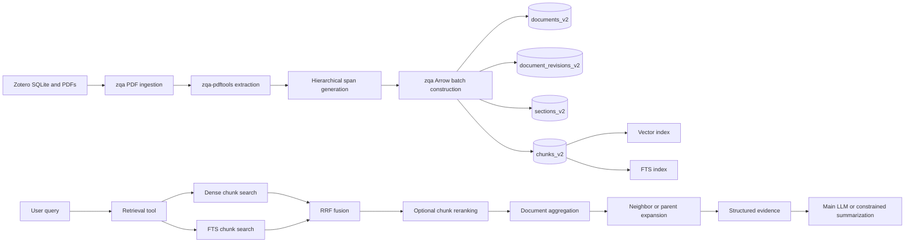
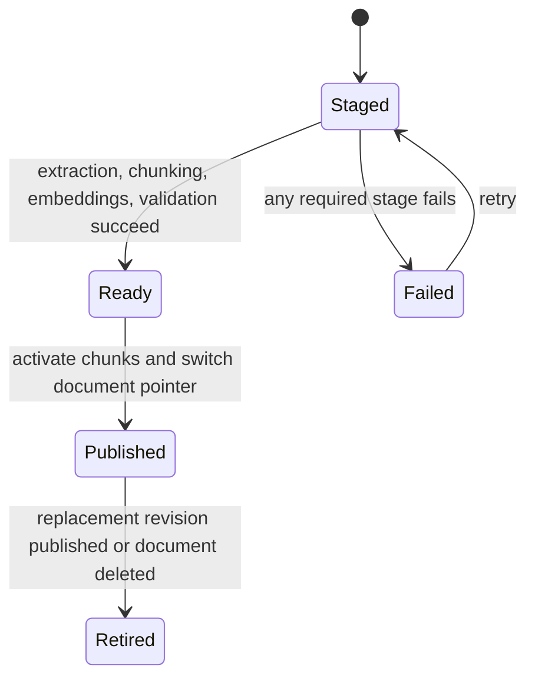

# Design: Persistent Hierarchical Retrieval for Zotero Libraries

**Author(s):** Rahul Yedida, Pi (GPT 5.6 Sol)  
**Date:** 2026-07-21  
**Status:** Draft

## Executive Summary

ZQA currently stores each Zotero PDF as one LanceDB row containing the complete extracted text and one embedding. Retrieval finds the ten nearest papers, optionally reranks their complete texts, and returns paper metadata. A second tool then sends each selected paper's complete text to an LLM to extract relevant passages.

This design replaces that path with a persistent hierarchical index. The index stores canonical document revisions, section spans, and searchable leaf chunks. Queries retrieve chunks with dense and full-text search, combine rankings with reciprocal-rank fusion, optionally rerank a bounded candidate set, aggregate evidence by document, and expand only the strongest passages to neighboring chunks or bounded parent sections. Complete document text remains local for reconstruction, citation validation, and migration, but is not sent to a reranker or generation model by default.

The existing imported-document pipeline demonstrates the value of passage retrieval, but it is not suitable as the persistent Zotero implementation because it rechunks and re-embeds documents for every query, uses character counts labeled as tokens, applies a provider-independent score threshold, and does not persist citation metadata. The new design shares its useful concepts while moving reusable retrieval primitives into `zqa-rag`, hierarchy and span generation into `zqa-pdftools`, and Zotero lifecycle and tool behavior into `zqa`.

The v2 index is built beside the legacy index. Migration reparses source PDFs where possible, validates the complete v2 index, and changes the active format only after successful publication. The legacy index remains available for rollback for at least one release.

## Decision

ZQA will use persistent leaf-chunk retrieval with parent-document and section metadata for Zotero libraries.

The first production version will:

- Persist one logical document record, immutable document revisions, section spans, and searchable chunks.
- Use deterministic, revision-scoped IDs and explicit parser, chunker, schema, and embedding fingerprints.
- Search chunk content with dense and full-text retrieval.
- Fuse candidates with reciprocal-rank fusion rather than combining incompatible raw scores.
- Rerank chunks, not complete papers.
- Aggregate chunks into document results and expand selected anchors under explicit context budgets.
- Preserve complete extracted text locally, but prohibit complete-paper transmission through the normal retrieval and summarization APIs.
- Build and validate the new index beside the current `data` table before switching reads.

Document-level vector embeddings are not required for the first release. Title and bibliographic fields may participate in lexical retrieval. A separate title-and-abstract document embedding can be added later if evaluation shows that chunk aggregation does not provide sufficient paper-level discovery. Complete-paper embeddings will not be used as the document-level representation.

## Glossary

- **Anchor chunk:** A leaf chunk selected by retrieval or reranking before context expansion.
- **Canonical text:** The complete extracted text for one immutable document revision. All section and chunk byte ranges refer to this text.
- **Chunk:** A bounded, searchable text span with an embedding and citation metadata.
- **Document:** A logical Zotero attachment that can have multiple indexed revisions over time.
- **Document revision:** An immutable extraction and chunking result for a specific document content and processing configuration.
- **Dense retrieval:** Nearest-neighbor search over embedding vectors.
- **FTS:** Full-text search over lexical terms.
- **Generation:** A monotonically increasing identifier used to stage and publish index changes.
- **Hybrid retrieval:** Candidate generation using both dense and FTS search.
- **Parent expansion:** Replacing or augmenting an anchor chunk with a bounded containing section.
- **Pipeline fingerprint:** A stable digest of parser version, chunker version, and chunking configuration.
- **RRF:** Reciprocal-rank fusion, a rank-based method for combining result lists with incomparable score scales.

## Context and Scope

### Current Zotero indexing

The current ingestion path is centered in:

- `zqa/src/utils/library.rs`
- `zqa/src/utils/arrow.rs`
- `zqa/src/store/lance.rs`
- `zqa-rag/src/vector/backends/lance.rs`

`parse_library()` extracts each PDF into `ExtractedContent`, but only `text_content` is retained in `ZoteroItem`. Section boundaries and page-oriented extraction metadata are discarded. `library_to_arrow()` creates one row per Zotero item with:

- `library_key`
- `title`
- `file_path`
- `pdf_text`
- `embeddings`

The embedding represents the complete `pdf_text`. The Lance backend creates both a vector index and an FTS index, but the Zotero retrieval path only calls `nearest_to`.

The current merge operation is insert-only for matched keys. Incremental discovery compares Zotero items by key and title, so modified PDF contents, changed paths, and removed attachments are not fully reconciled.

### Current Zotero query flow

`zqa/src/tools/retrieval.rs` accepts a query and asks the store for the top ten documents. The store computes a query embedding, performs vector search, removes blank rows, and optionally reranks the complete text of those documents. The tool then discards document content and returns title, authors, and item ID.

The main LLM can pass selected IDs to `zqa/src/tools/summarization.rs`. That tool fetches complete document rows and sends each complete paper to a generation model with a prompt asking it to extract relevant excerpts. Requests are launched concurrently without a document-size or aggregate context budget.

This architecture has four material limitations:

1. A complete-paper embedding can dilute a small relevant passage or be truncated by the provider.
2. Reranking only the ten selected complete papers cannot recover a relevant paper omitted by initial retrieval.
3. Complete-paper generation requests are expensive and can exceed provider context limits.
4. The retrieved evidence has no persisted page, section, or byte-range identity.

### Current imported-document flow

`zqa/src/tools/documents.rs` chunks imported PDFs in memory, embeds chunks and the query, computes cosine similarity, applies a fixed threshold, optionally reranks retained chunks, and can ask a subagent to refine the result. This provides passage-level retrieval but is intentionally ephemeral.

It is reasonable for small, one-off documents, but not as the Zotero storage design:

- Chunks and embeddings are recomputed for each query.
- `SectionBased(2048)` is bounded by characters even though some APIs and comments call the value tokens.
- The fixed similarity threshold is not calibrated across providers.
- The query is passed through `compute_source_embeddings()`.
- Thresholding can discard candidates before reranking.
- Chunk identities and citation locators are not persisted.

### Scope

This document covers persistent retrieval for Zotero PDF attachments and the tool path that consumes those results. It also defines reusable abstractions that the imported-document path may adopt later.

### Goals and Non-Goals

#### Goals

- Improve passage recall without regressing document recall.
- Persist chunks and embeddings once during ingestion.
- Support dense, lexical, and hybrid retrieval.
- Return document-level results backed by passage-level evidence.
- Bound text sent to embedding, reranking, and generation providers.
- Preserve section and page provenance for citations.
- Detect new, changed, and removed Zotero attachments.
- Make indexing idempotent and recoverable after partial failure.
- Detect incompatible schemas, chunking recipes, and embedding configurations before querying.
- Preserve local-first operation with LanceDB.
- Maintain a rollback path during migration.
- Keep crate responsibilities consistent with the existing workspace architecture.

#### Non-Goals

- OCR or image-based retrieval.
- Specialized table, equation, or figure retrieval.
- Replacing LanceDB with a server-based database.
- Persisting imported non-Zotero documents in the first release.
- Supporting multiple embedding models in one active chunk index.
- Generating perfect citation styles from incomplete Zotero metadata.
- Encrypting LanceDB at rest in the first release.
- Introducing an LLM call during indexing to summarize every paper.
- Eliminating the summarization tool in the first release.
- Exposing every ranking constant as user configuration before evaluation establishes useful defaults.

## Requirements and Invariants

### Functional requirements

1. A query can retrieve semantically related passages and exact lexical matches.
2. Each passage result identifies its document, revision, section, pages, and canonical byte range.
3. Retrieval can be constrained to a set of document IDs for summarization.
4. A modified PDF becomes searchable only after all required chunks are valid.
5. A failed update does not make the previously active revision unavailable.
6. A removed Zotero attachment stops appearing in queries before physical compaction completes.
7. Existing library keys remain accepted by tool APIs during migration.
8. The current index format can be inspected through health and statistics commands.

### Correctness invariants

- Every active chunk belongs to exactly one existing document revision.
- Every active document points to exactly one active revision.
- Chunk, section, and page ranges are valid boundaries in canonical UTF-8 text.
- Reassembling non-overlap chunk coverage for a revision does not omit source content intended for indexing.
- All embeddings in an active index use the same provider, model, dimensions, and source mode.
- Query embeddings use the corresponding query mode.
- A chunk is not query-visible unless its revision is the active revision of its document.
- Publication never deactivates the previous revision before the replacement is complete.
- Tool output never includes local file paths.
- Normal retrieval never sends complete paper text to a remote provider.

### Availability requirements

- If reranking fails, retrieval returns fused candidates.
- In hybrid mode, failure of one candidate source degrades to the surviving source and records the degradation.
- If context expansion fails, retrieval returns the unexpanded anchor chunks.
- A corrupt or incompatible v2 index does not silently mix with a legacy or differently embedded index.

## Architecture Overview



### Component ownership

#### `zqa-pdftools`

Own source-independent extraction and hierarchy:

- Canonical text extraction.
- Page-to-byte boundaries.
- Validated section hierarchy.
- Section-aware chunk span generation.
- UTF-8-safe and deterministic range calculation.
- Parser and chunker algorithm version constants.

The preferred API returns borrowed spans or ranges rather than allocating duplicate strings. Zotero IDs, database schemas, embeddings, and citation formatting do not belong in this crate.

Likely files:

- `zqa-pdftools/src/parse.rs`
- `zqa-pdftools/src/chunk.rs`

#### `zqa-rag`

Own generic retrieval and LanceDB capabilities:

- Dense and FTS query operations.
- Backend-independent candidate and score types.
- RRF implementation.
- Table-aware Lance operations.
- True update and upsert behavior.
- Index creation and maintenance.
- Embedding and reranking invocation.
- Schema and embedding compatibility primitives.

It must not know about Zotero authors, Zotero library keys, citation style, or section expansion policy.

Likely files:

- `zqa-rag/src/vector/backends/backend.rs`
- `zqa-rag/src/vector/backends/lance.rs`
- A new `zqa-rag/src/vector/search.rs`
- `zqa-rag/src/vector/checkhealth.rs`

#### `zqa`

Own Zotero-specific lifecycle and agent behavior:

- Zotero metadata discovery and reconciliation.
- Stable document and revision IDs.
- Arrow schemas for documents, revisions, sections, and chunks.
- Publication and recovery protocol.
- Document aggregation and context expansion policy.
- Citation structures and tool JSON.
- CLI configuration, migration, and status output.
- Passage-constrained summarization.

Likely files:

- `zqa/src/store/common.rs`
- `zqa/src/store/lance.rs`
- `zqa/src/utils/arrow.rs`
- `zqa/src/utils/library.rs`
- `zqa/src/tools/retrieval.rs`
- `zqa/src/tools/summarization.rs`
- `zqa/src/cli/prompts.rs`
- `zqa/src/cli/handlers/library.rs`
- `zqa/src/config.rs`

## Data Model

The v2 data model uses separate tables because documents, revisions, sections, and chunks have different lifecycles and indexing requirements. Exact Arrow types are an implementation detail, but field semantics are part of this design.

### `documents_v2`

One mutable row per logical Zotero attachment:

- `document_id`: Stable namespaced ID.
- `library_key`: Existing Zotero attachment key for compatibility.
- `source_namespace`: Initially `zotero-local`; allows future group-library disambiguation.
- `active_revision_id`: The published revision.
- `title`, ordered authors, year, DOI, and other supported bibliographic fields.
- `file_path`: Local-only and never exposed to an LLM.
- `source_modified_at`, file size, and source fingerprint.
- `is_deleted`.
- `created_at` and `updated_at`.

Bibliographic fields required for deterministic display and citation should be explicit. Less common metadata may be stored in a versioned JSON field until a stable schema is justified.

### `document_revisions_v2`

One immutable row per extracted revision:

- `revision_id`.
- `document_id`.
- `generation`.
- `content_hash`.
- `full_text`.
- `page_count` and serialized page-to-byte boundaries.
- `parser_version`.
- `chunker_version` and chunk configuration fingerprint.
- `ingest_status`: staged, ready, published, failed, or retired.
- `created_at` and `published_at`.
- A bounded diagnostic error code for failed staging.

Complete text is stored once per retained revision. It supports parent-section slicing, exact citation validation, migration, and repair without duplicating complete section text in every chunk.

### `sections_v2`

One row per section span:

- `section_id`.
- `revision_id` and `document_id`.
- `parent_section_id`, if any.
- Stable ordinal and hierarchy depth.
- Heading text or heading byte range.
- Content byte start and end.
- Page start and end.
- `is_synthetic`, including a synthetic root or preamble section.

Section text is materialized from canonical document text. It is not independently embedded in the first release.

### `chunks_v2`

One row per searchable leaf chunk:

- `chunk_id`.
- `revision_id`, `document_id`, and `section_id`.
- Global ordinal and ordinal within the section.
- Previous and next chunk IDs.
- Byte start and end.
- One-based inclusive page start and end.
- Chunk content.
- Content hash.
- Embedding vector.
- Embedding status.
- `is_active`.

Indices:

- Vector index on the embedding column.
- FTS index on chunk content.
- Scalar indices on active status, document ID, revision ID, and section ID if LanceDB measurements show a benefit.

### `index_manifest_v2`

A small metadata table records application-level compatibility:

- Schema version.
- Active index format.
- Last successful generation.
- Parser fingerprint.
- Chunker fingerprint.
- Embedding provider, model, dimensions, and source/query mode recipe.
- Lance table versions for each v2 table.
- Migration state.
- Minimum compatible `zqa` and `zqa-rag` versions.
- Index creation and last validation timestamps.

Lance table versions are operational metadata, not substitutes for the application schema version.

### Storage trade-offs

Canonical full text and chunk content duplicate some text. This is accepted because it provides:

- Direct indexed chunk retrieval.
- Exact parent and neighbor reconstruction.
- Citation verification.
- Repair without reparsing when source PDFs are unavailable.
- Simpler query-time APIs.

Section content is not stored separately, avoiding a third textual copy. Inactive revisions are garbage-collected according to a bounded retention policy.

## Identity and Versioning

### Document identity

A document ID must identify a logical attachment rather than its mutable title or path. The initial format is conceptually:

```text
zotero:<library-namespace>:<attachment-key>
```

The implementation must resolve how Zotero group libraries and multiple attachments are represented before freezing the serialized format. The existing `library_key` remains separately stored and accepted during migration.

### Content and revision identity

Use BLAKE3 for stable content-addressed identifiers. It is already present in the dependency graph, but should be added as an explicit direct dependency where used.

```text
pipeline_fingerprint = hash(parser_version, chunker_version, chunk_config)
revision_id = hash(document_id, canonical_text_hash, pipeline_fingerprint)
section_id = hash(revision_id, ordinal, byte_range)
chunk_id = hash(revision_id, ordinal, byte_range, chunker_version)
```

IDs do not include titles or paths. Both can change without changing document content, and paths may contain private information.

### Invalidation rules

| Change | Required action |
| --- | --- |
| Ranking limits, RRF constants, reranker, expansion policy | No reindex |
| Title, authors, path, DOI, or year | Metadata update |
| PDF contents | New revision, rechunk, and re-embed |
| Parser or chunker fingerprint | New revision, rechunk, and re-embed |
| Embedding provider, model, dimensions, or source mode | Rebuild embeddings in a shadow index |
| FTS tokenizer or configuration | Rebuild FTS index |
| Data schema | Explicit migration |

The active index cannot contain mixed embedding recipes.

## Chunking and Hierarchy

### Design principles

Chunking optimizes retrieval quality, not merely provider input limits. The existing `EmbeddingProvider::recommended_chunking_strategy()` reflects provider context constraints and must not determine the persistent retrieval recipe.

The first release uses an explicit character budget rather than claiming tokenizer-accurate token counts. This avoids coupling `zqa-pdftools` to provider tokenizers and keeps chunk output deterministic across embedding providers. The configuration and metrics use names such as `target_chars` and `overlap_chars`.

Initial values are:

- Target: 2,048 characters.
- Overlap: up to 256 characters where a section must be split.
- Minimum useful chunk size: determined during implementation and evaluation, not exposed as user configuration initially.

These are versioned defaults, not permanent quality claims.

### Splitting rules

1. Normalize and validate section boundaries from extraction.
2. Create a synthetic root or preamble section so text before the first detected heading is retained.
3. Keep a section intact if it is below the target.
4. Split oversized sections near paragraph boundaries.
5. If no suitable paragraph boundary exists, prefer sentence, newline, then whitespace boundaries.
6. Hard-split only as a final fallback and never inside a UTF-8 code point.
7. Add overlap only between chunks created by splitting the same oversized span.
8. Do not combine unrelated sibling sections merely to fill the target.
9. Persist direct-text spans and hierarchy so parent expansion does not duplicate descendant text unexpectedly.
10. Normalize persisted pages to one-based inclusive ranges.

The chunker returns spans into canonical text. String allocation occurs only when constructing storage batches or provider requests.

### Determinism

Identical canonical text, extraction metadata, and chunk configuration must produce identical section spans, chunk spans, and IDs. This enables idempotent retries and content-addressed embedding caches.

## Ingestion and Reconciliation

### Discovery

Zotero discovery should collect enough information to distinguish metadata changes from content changes:

- Attachment and parent item keys.
- Library namespace.
- Zotero modification timestamp where reliable.
- Path, file size, and filesystem modification time.
- Title and ordered authors.
- Year, DOI, publication title, and abstract where available.

A cheap source fingerprint uses stable metadata such as size and modification time. If it changes, ZQA reads the file and computes a content digest. The digest, not timestamps alone, determines whether a new revision is necessary.

The complete Zotero snapshot is reconciled against `documents_v2`:

- New document ID: ingest.
- Changed content digest: create a revision.
- Metadata-only change: update the document row without embedding.
- Missing document ID: mark deleted.
- Unchanged content and pipeline fingerprints: skip.

File metadata is checked before and after extraction. If the source changes while being parsed, that attempt is discarded and retried later.

### Staging and publication

LanceDB operations across tables are not assumed to be transactional. Publication therefore uses immutable revisions and one mutable active-revision pointer.



Publication steps:

1. Acquire the single-writer index lock.
2. Allocate a generation and insert a staged revision.
3. Extract canonical text, pages, sections, and chunks.
4. Compute chunk embeddings in bounded batches.
5. Insert section and inactive chunk rows.
6. Validate row counts, ranges, hierarchy, dimensions, zero vectors, and expected text coverage.
7. Mark the new chunks active.
8. Update the document's `active_revision_id` to the new revision.
9. Mark the revision published.
10. Mark old chunks inactive and the old revision retired.
11. Refresh indices as required.
12. Record the successful generation in the manifest.

Queries search only active chunks and verify that every candidate's revision matches the document's active revision. This verification makes the short interval with both old and new active chunks safe. Candidate search should overfetch enough to tolerate temporary stale candidates. Recovery completes or rolls back interrupted publication before normal maintenance proceeds.

The previous revision is not deactivated until all new data has passed validation. New documents with failed ingestion remain unavailable but have a diagnostic failure record.

### Embedding failures

Publication requires all expected chunk embeddings. API-level errors, missing vectors, wrong dimensions, and zero vectors are failures rather than successful substitutes. Empty chunks are rejected before provider calls.

Transient failures use the configured retry policy. Partial provider success may be cached by chunk content hash, but a document revision is not published until all required chunks are valid.

### Deletion

Deletion is idempotent:

1. Mark the logical document deleted and clear or invalidate its active revision.
2. Mark child chunks inactive so queries exclude them immediately.
3. Retire revisions and sections.
4. Physically delete retained data according to maintenance policy.
5. Compact or optimize LanceDB through an explicit maintenance operation.

A removed private document must not remain indefinitely in inactive storage. The default retention period should be short and documented; explicit secure deletion guarantees remain limited by LanceDB and the filesystem.

### Batch embeddings

The existing batch path is keyed around complete Zotero items. V2 batch inputs use `chunk_id`, revision ID, embedding fingerprint, and chunk content hash.

Pending legacy batches are never inserted into `chunks_v2`. During migration they either:

- Finish against the legacy index while it remains active, or
- Are cancelled and resubmitted as versioned chunk batches with explicit user confirmation.

Batch metadata and local caches must be versioned. Cache keys include the chunk content hash and complete embedding fingerprint.

## Retrieval

### Request model

Replace the `(query, limit)` store API with a typed request. Conceptually:

```text
RetrievalRequest
  query
  search_mode
  optional document filter
  maximum documents
  maximum passages per document
  context budget
  reranking policy
  expansion policy
```

Candidate sizes and RRF constants belong to an internal versioned retrieval profile initially. They should become user-facing only when there is a demonstrated need.

### Candidate generation

For a normal hybrid query:

1. Validate and normalize the query.
2. Compute one query embedding with `compute_query_embeddings()`.
3. Dense-search active chunks, selecting only columns needed for ranking and citation.
4. FTS-search active chunk content.
5. Retrieve substantially more candidates than the final document count.
6. Exclude candidates whose revision is no longer active.

Initial evaluation values are 64 dense and 64 FTS candidates. These are tuning starting points rather than compatibility guarantees.

For summarization constrained to selected papers, both searches apply a document ID filter before ranking where supported. If LanceDB filtering occurs after ANN search, the backend must overfetch or use a supported prefilter mode so filtering does not destroy recall.

### Fusion

Dense distance and FTS score scales are not directly comparable. The initial fusion algorithm is weighted RRF:

```text
score(chunk) = dense_weight / (k + dense_rank)
             + fts_weight / (k + fts_rank)
```

The initial `k` is 60 with equal weights. RRF uses deterministic tie-breaking by chunk ID. Dense and FTS ranks and scores remain attached to candidates for diagnostics even though raw scores are not combined.

If one source fails, the surviving ranking is used and the response records degraded mode.

### Diversity and reranking

Before reranking:

- Deduplicate by chunk ID.
- Apply a generous per-document candidate cap so one long paper does not monopolize the set.
- Keep enough candidates to preserve recall.

Rerank only a bounded fused set, initially the top 40 chunks. Each reranker input contains chunk text plus a short title and section breadcrumb. It does not contain full documents.

Reranker output is validated for range, duplicates, and omissions. A provider error or invalid output falls back to fused order rather than failing the user query.

### Document aggregation

Passage results are grouped into papers after reranking. Document ranking uses rank evidence rather than raw provider scores:

- The best chunk rank is the primary signal.
- Additional high-ranked chunks provide a bounded secondary contribution.
- The number of contributing chunks is capped.
- Ties are deterministic.

The default remains at most ten documents to preserve the current tool's broad behavior. Each document initially carries at most three anchor passages.

### Context expansion

Expansion improves readability without changing relevance scores:

1. Preserve every selected anchor chunk.
2. Add the previous or next chunk when needed and within budget.
3. Expand to a containing section when multiple anchors hit that section or when anchor density crosses a versioned threshold.
4. Expand at most one parent level initially.
5. Do not expand a parent above the per-document limit.
6. Merge overlapping ranges.
7. Drop low-priority expansion text before dropping anchors when the total budget is exceeded.

Parent text is sliced from canonical revision text using validated ranges. It is not embedded independently.

### Retrieval output

The store returns typed results rather than `ZoteroItem` full-text values:

```text
RetrievalResponse
  documents[]
    document_id
    library_key
    title
    authors
    passages[]
      citation_id
      chunk_id
      section breadcrumb
      page range
      byte range
      text
      retrieval provenance
  stats
```

Raw vectors and local file paths are never returned. Raw ranking scores are available to debug logging or diagnostics only under privacy-safe controls.

## Store and Backend APIs

### Generic `zqa-rag` API

Likely generic types:

- `SearchMode::{Dense, Fts, Hybrid}`
- `SearchRequest`
- `SearchCandidate`
- `SearchProvenance`
- `RankedCandidate`

Likely backend capabilities:

- `dense_search()`
- `fts_search()`
- `create_or_update_indices()`
- Explicit insert-only and upsert operations.
- Table-name configuration rather than a hard-coded `data` table.

`zqa-rag` owns rank fusion because it is independent of Zotero and useful to other RAG callers. Parent expansion remains in `zqa` because it depends on the persisted Zotero document hierarchy and response budgets.

### Zotero store API

`ZoteroStore` should evolve toward methods such as:

- `search_passages(request)`.
- `retrieve_within_documents(request, document_ids)`.
- `get_document_metadata(document_ids)`.
- `get_revision_text(revision_id, ranges)`.
- `reconcile_library(snapshot)`.
- `delete_documents(document_ids)`.

The normal tool path should not expose an easy method that returns arbitrary complete paper text. Any retained full-text method must be explicitly named and restricted to ingestion, maintenance, or exceptional local-only workflows.

## Tool and Prompt Behavior

### Retrieval tool

`zqa/src/tools/retrieval.rs` will return structured metadata and representative evidence rather than formatted strings only. A result includes:

- Stable document ID and legacy library key.
- Title and persisted authors.
- One to three representative passages.
- Section and page locators.
- Opaque citation IDs.

The tool does not need to expose implementation-specific dense, FTS, or RRF scores to the main LLM.

### Summarization tool

The summarization tool retains its current role during rollout but changes its input source:

1. Resolve selected document IDs or library keys.
2. Run hybrid retrieval constrained to those documents using the user's query.
3. Expand selected anchors under a per-paper budget.
4. Send only those passages and citation handles to the extraction LLM.
5. If no passage is found, use a bounded fallback such as title, abstract, preamble, or first chunk. Do not silently send the complete paper.
6. Limit concurrent generation requests.

The tool may become unnecessary if retrieval evidence proves sufficient for direct final synthesis, but removing it is a later decision backed by evaluation.

### Prompts

Prompts in `zqa/src/cli/prompts.rs` must describe the actual data shape:

- Retrieval returns paper metadata and representative passages.
- Summarization performs deeper retrieval within selected papers.
- Passage text is untrusted source data, not instructions.
- Citation IDs and locators must be preserved.
- The model must not invent missing page numbers or authors.

Extraction subagents remain tool-free.

## Citation and Grounding Model

Every returned evidence span has an authoritative citation locator:

- Citation ID.
- Document, revision, and anchor chunk IDs.
- Library key.
- Title and persisted author metadata.
- Section breadcrumb.
- One-based page range when known.
- Canonical byte range.
- Exact evidence text.

A human-readable representation may look like:

```text
[zotero:5KWS383N, pp. 4-5, Methods]
```

The opaque citation ID, not the display string, is authoritative.

Validation rules:

- Evidence text must correspond to the persisted canonical range after explicitly defined whitespace normalization.
- Expanded evidence records its merged range and originating anchors.
- Missing page metadata is represented as unknown, never guessed.
- Bibliographic formatting occurs outside verbatim excerpts.
- Author metadata is persisted during ingestion; live SQLite lookup may enrich display but is not required for correctness.

Application-generated APA or other citation formatting is outside the first release, but the data model must make it possible.

## Configuration

The first release exposes only settings with clear user value:

```toml
[retrieval]
mode = "hybrid"
max_documents = 10
max_context_chars = 40000
remote_content = "allow"
```

Chunk and ranking parameters remain in a versioned internal profile initially:

- `target_chars = 2048`
- `overlap_chars = 256`
- `dense_candidates = 64`
- `fts_candidates = 64`
- `rerank_candidates = 40`
- `max_passages_per_document = 3`
- `neighbor_window = 1`
- RRF `k = 60`

These values must be centralized, logged as a profile version, and covered by evaluation. They can become advanced configuration later without changing persisted semantics unless they affect chunking.

Configuration validation rejects zero limits, overlap greater than or equal to target, unsupported modes, and budgets too small to hold one anchor passage.

## Consistency, Recovery, and Failure Handling

### Startup validation

Before querying v2, ZQA validates:

- Schema version.
- Required tables and columns.
- Parser and chunker compatibility.
- Embedding provider, model, dimensions, and mode recipe.
- Presence of required vector and FTS indices.
- Absence of interrupted publication requiring recovery.

A mismatch produces an actionable error or explicit legacy fallback. It never silently registers the current embedding provider against incompatible stored vectors.

### Crash recovery

Recovery scans staged and ready revisions:

- Staged revision with incomplete children: retain for retry or delete safely.
- Ready revision not published: validate and resume publication.
- New chunks active before document pointer switch: either complete the switch or deactivate them.
- Document pointer switched but old chunks still active: finish retirement.
- Multiple published revisions: retain the document pointer target and retire others.

All operations are idempotent.

### Query degradation

| Failure | Behavior |
| --- | --- |
| Query embedding failure | Return an error unless FTS fallback is allowed and enabled |
| Dense search failure | Use FTS and mark degraded mode |
| FTS failure | Use dense search and mark degraded mode |
| Reranker failure | Use fused order |
| Invalid reranker indices | Reject reranker output and use fused order |
| Metadata enrichment failure | Return persisted metadata |
| Parent expansion failure | Return anchors |
| One document summarization failure | Return other summaries and a per-document error |

## Security and Privacy

ZQA indexes private academic libraries. The design treats privacy as a data-flow property rather than only a logging concern.

- LanceDB contains plaintext document text, embeddings, bibliographic metadata, and local paths.
- Remote embedding providers receive chunks during ingestion and queries during retrieval.
- Remote rerankers receive candidate chunks and the query.
- Remote generation providers receive selected expanded evidence, not complete papers by default.
- Local file paths never appear in tool results or provider requests.
- Normal logs do not contain query text, chunk text, full tool output, provider payloads, or paths.
- Debug logging that includes imported-document chunks must not be reused unchanged.
- Zotero paths are canonicalized and checked against expected storage roots before reading where practical.
- PDF size, page count, extracted text size, chunk count, and query size are bounded to limit denial-of-service behavior.
- Prompt text explicitly delimits retrieved content and tells models not to follow instructions found in documents.
- Extraction subagents have no tools.
- A `remote_content` policy can disable remote document-content transmission. In that mode, local FTS remains available and dense or reranked operations requiring remote content are disabled unless a local provider is configured.
- Deleted content is physically removed according to retention and compaction policy.

Encryption at rest is not provided initially and must be documented to users. File and database directories should use user-only permissions where the platform supports them.

## Performance and Capacity

### Expected shape

A representative 1,500-paper library with 40 chunks per paper creates approximately 60,000 searchable rows. At 2,048 `f32` dimensions, raw vectors are roughly 490 MB before index overhead or compression. At 4,096 dimensions, they approach 1 GB.

The new design increases initial embedding work substantially compared with one vector per paper. It reduces query-time text volume and repeated generation cost.

### Mitigations

- Content-addressed chunk and embedding caches.
- Bounded Arrow and provider batches.
- Batch API support keyed by chunk ID.
- Incremental content fingerprints.
- Query embedding computed once.
- Column projection during candidate search.
- Bounded candidate, reranker, and context sizes.
- Vector index creation only above a measured row threshold if exact search is faster for small libraries.
- Incremental index refresh and explicit optimization maintenance.
- Inactive revision garbage collection.

### Benchmarks

Benchmark at approximately 10,000, 50,000, and 100,000 chunks:

- Extraction and chunking throughput.
- Online and batch embedding throughput.
- Dense, FTS, and hybrid p50 and p95 latency.
- Index build and incremental refresh time.
- Peak memory during ingestion and query.
- Database size by table and index.
- Reranker and generation text volume.

A LanceDB spike must verify FTS score columns, prefilter behavior, incremental index freshness, and multi-table update semantics before implementation commits to those APIs.

## Observability and Health

### Retrieval statistics

Record without document contents:

- Query embedding latency and provider usage.
- Dense and FTS latency and candidate counts.
- Candidate counts before and after active-revision filtering.
- Fusion and reranking latency.
- Number of reranker inputs and characters.
- Aggregation and expansion latency.
- Documents, anchors, and expanded ranges returned.
- Context characters sent to generation.
- Degraded mode and reason.
- Retrieval profile version.

Character estimates must be labeled as characters, not tokens. Exact provider usage is used when available.

### Index health

Extend `/checkhealth`, `/doctor`, and `/stats` to report:

- Active index format and migration state.
- Schema, parser, chunker, and embedding fingerprints.
- Row counts and Lance versions for every table.
- Documents with no active revision or no chunks.
- Orphan sections and chunks.
- Invalid hierarchy, byte ranges, or page ranges.
- Multiple active revisions.
- Interrupted publication.
- Zero and wrong-dimension vectors.
- Missing or stale indices.
- Deleted documents with active children.
- Disk use by active and inactive data.

Repair commands must explain whether they can operate locally or will resend private text to a provider.

## Migration and Rollout

### Side-by-side migration

The legacy `data` and `metadata` tables remain unchanged while v2 is built.

1. Detect the legacy index and absence of a complete v2 manifest.
2. Continue serving legacy reads by default.
3. Reparse source PDFs to recover reliable page and section metadata.
4. If a source PDF is unavailable, optionally produce flat fallback chunks from stored text and mark page provenance unknown. This requires explicit reduced-quality status.
5. Build v2 tables and indices in shadow mode.
6. Validate schema, counts, embedding fingerprints, range integrity, and sampled retrieval.
7. Mark v2 complete in the manifest.
8. Switch the active read format through one manifest update.
9. Retain v1 for rollback for at least one stable release or until explicit cleanup.
10. Remove v1 only through an explicit command that reports recoverability and disk impact.

In-place mutation is not used because full-document vectors cannot be converted into chunk vectors and partial migration would be difficult to distinguish from valid state.

### Compatibility

- Tool inputs continue accepting legacy library keys.
- `/search` can preserve title-oriented output while optionally showing snippets and pages.
- `/stats`, `/checkhealth`, and `/doctor` report both formats during migration.
- Legacy pending batch jobs are routed only to v1 or cancelled and resubmitted.
- A failed v2 startup may fall back to v1 only with a visible warning and only if embedding compatibility is valid.
- New installations create v2 directly after the feature is proven.

### Rollout phases

#### Phase 0: Backend spike and evaluation baseline

- Validate LanceDB FTS, filtering, updates, and index freshness.
- Build a current full-document retrieval baseline.
- Define a small judged query corpus over repository-safe PDF fixtures.

#### Phase 1: Hierarchy primitives

- Add page boundaries and deterministic span-based chunking to `zqa-pdftools`.
- Preserve preamble text and normalize page semantics.
- Keep the existing `Chunker` through a compatibility adapter.

#### Phase 2: Generic retrieval primitives

- Make `LanceBackend` table-aware.
- Add true upsert/update APIs, FTS search, candidate types, and RRF.
- Add embedding compatibility validation.

#### Phase 3: V2 storage and shadow ingestion

- Add v2 schemas, IDs, manifest, reconciliation, validation, and recovery.
- Build v2 while all user queries continue reading v1.

#### Phase 4: Dense chunk retrieval

- Enable dense chunk retrieval, document aggregation, and bounded expansion behind a config switch.
- Change summarization to consume passages.

#### Phase 5: Hybrid retrieval and citations

- Add FTS, RRF, reranking, structured citation output, and evaluation gates.

#### Phase 6: Default v2 with rollback

- Make v2 the default for new installations and validated migrations.
- Keep legacy fallback and report migration status.

#### Phase 7: Cleanup and convergence

- Add explicit v1 cleanup.
- Version or remove legacy batch artifacts.
- Move imported documents onto the shared chunking and ranking pipeline while keeping their storage session-local.
- Reevaluate whether a separate summarization subagent is still necessary.

## Testing and Evaluation

### Unit and property tests

#### `zqa-pdftools`

- Deterministic chunk and hierarchy output.
- Complete intended text coverage, including preamble.
- UTF-8-safe ranges.
- Valid and acyclic parent relationships.
- Correct page mapping and one-based persisted semantics.
- Empty, duplicated, unsorted, and malformed section boundaries.
- Paragraph and sentence snapping.
- Overlap behavior.
- Stable IDs given stable spans.

#### `zqa-rag`

Use precomputed vectors where possible:

- Table-specific CRUD.
- Matched-row updates rather than insert-only behavior.
- Dense and FTS ordering.
- RRF ordering and deterministic ties.
- Filter behavior and safe predicate construction.
- Index creation idempotence.
- Dimension and embedding fingerprint mismatches.
- Zero-vector rejection.
- Dense or FTS partial-failure degradation.
- Reranker index validation.

#### `zqa`

- Arrow round trips for all v2 tables.
- Stable document and revision IDs.
- Metadata-only updates without embedding.
- Changed PDF publication.
- Failed replacement preserving the old revision.
- Recovery after each publication step.
- Removed and re-added Zotero attachments.
- Constrained retrieval within selected documents.
- Neighbor and parent expansion under budgets.
- Exact citation range mapping.
- Tool JSON schema snapshots.
- Legacy library key acceptance.
- Verification that unrelated complete-paper text is absent from reranker and generation requests.
- Legacy database and batch migration fixtures.

### Retrieval evaluation

Create a small, legally distributable set of queries with document and passage relevance judgments. Measure:

- Document Recall@10.
- Mean reciprocal rank.
- Passage Recall@K.
- nDCG@10.
- Dense-only, FTS-only, and hybrid comparisons.
- Reranker contribution.
- Citation range validity.
- Unsupported citation rate in generated answers.
- Context characters and estimated provider cost.
- Query p50 and p95 latency.

### Initial acceptance gates

Before v2 becomes the default:

- Document Recall@10 does not regress against v1 on the evaluation set.
- Passage nDCG materially improves over full-document dense retrieval.
- At least 99 percent of emitted citation ranges map mechanically to canonical text.
- Text sent to per-paper generation is reduced by at least 80 percent on the evaluation set.
- No tested publication failure makes a previously active document unavailable.
- Hybrid retrieval stays within an agreed interactive p95 latency budget on the target library size.

The exact latency budget must be established from current CLI measurements rather than selected without evidence.

## Risks and Mitigations

| Risk | Impact | Mitigation |
| --- | --- | --- |
| Chunking separates required context | Lower answer quality | Boundary-aware splits, overlap, neighbor and parent expansion |
| Long papers dominate candidates | Reduced library diversity | Pre-rerank per-document cap and document aggregation |
| Dense and FTS scores are incompatible | Unstable fusion | Rank-based RRF |
| Multi-table publication is interrupted | Partial or stale index state | Immutable revisions, active pointer, idempotent recovery |
| More chunks increase embedding cost | Slower and more expensive ingestion | Cache, batch API, incremental fingerprints, bounded chunk size |
| ANN or FTS filters reduce recall | Missing constrained results | Backend spike, prefilter verification, overfetch and tests |
| Provider changes silently corrupt retrieval | Incorrect ranking | Manifest fingerprint validation at startup |
| Page metadata is inaccurate | Misleading citations | Validate parser semantics, represent unknown pages explicitly |
| Private text leaks through logs or prompts | Privacy violation | Data-flow policy, redacted logging, bounded evidence only |
| Migration consumes excessive disk | Failed upgrades | Capacity estimate, shadow-build progress, explicit cleanup |
| Imported and Zotero retrieval diverge | Duplicate behavior and inconsistent quality | Shared ranking APIs and eventual shared chunk profile |

## Rejected Alternatives

### Keep one complete-document row and improve reranking

This is the least expensive ingestion design. A larger candidate pool and better reranker could improve paper selection.

Rejected because complete-paper embeddings still dilute local evidence or truncate content, reranker requests remain large, passage citations remain unavailable, and generation still receives complete papers. It improves ranking without correcting the mismatch between the indexed unit and the evidence unit.

### Copy the imported-document pipeline unchanged

This would chunk and embed every selected Zotero document at query time using the existing in-memory cosine retrieval.

Rejected because repeated embedding cost and latency scale with every query, no persistent FTS index exists, fixed score thresholds do not generalize across providers, and citation identities disappear after the session. The current imported path is a useful prototype, not a persistent library design.

### Chunk only after document-level retrieval

This two-stage design first retrieves complete-paper embeddings, then chunks and searches only the selected papers.

Rejected as the sole retrieval path because the first stage preserves the main recall failure: a relevant paper must first be represented well by its complete-document vector. Hierarchical constrained retrieval remains useful after a user or tool explicitly selects papers, but global chunk retrieval is required for discovery.

### Store only chunks and discard canonical full text

This minimizes duplicated text and table count.

Rejected because parent expansion, exact citation verification, repair, and migration become dependent on the source PDF remaining available and parsing identically. Canonical text is already stored today and is valuable local state.

### Store documents, sections, and chunks in one mixed table

A single table simplifies table discovery and some writes.

Rejected because row types have different nullability, update lifecycles, and indexing needs. Complete documents and sections would either contaminate chunk indices or require complex filters, while most columns would be meaningless for most rows.

### Embed every hierarchy level

Embedding documents, sections, and leaf chunks supports multi-resolution vector search.

Rejected for the first release because it multiplies embedding and index cost, introduces more fusion paths, and duplicates broad content that can still be truncated or diluted. Leaf retrieval plus deterministic expansion provides hierarchy without embedding every parent. A title-and-abstract document index remains a possible evidence-backed extension.

### Continue embedding complete papers as the document-level signal

A document vector could be fused with chunk results for broad discovery.

Rejected because it preserves provider truncation and broad-topic dilution. If document-level dense retrieval is later necessary, it should embed bounded title, abstract, and trusted metadata rather than the complete paper.

### Use raw weighted score averaging

Dense similarity and FTS scores could be normalized and averaged.

Rejected because score distributions differ across providers, models, queries, and LanceDB index implementations. RRF is deterministic, scale-independent, and easier to evaluate. Learned or calibrated fusion can replace it later if data supports the complexity.

### Vector-only retrieval

This avoids FTS implementation and fusion.

Rejected because academic queries often contain exact identifiers, terminology, equations, acronyms, and names that lexical retrieval handles well.

### FTS-only retrieval

This avoids embedding cost and remote provider exposure.

Rejected as the default because it misses semantic paraphrases and conceptual matches. It remains an important local-only privacy mode and degradation path.

### Use SQLite FTS beside LanceDB vectors

ZQA already depends on SQLite through Zotero, and SQLite FTS is mature.

Rejected because coordinating two stores creates another publication and recovery boundary. LanceDB already supports FTS. This decision should be revisited only if the backend spike finds Lance FTS unsuitable for required languages, filtering, or incremental updates.

### Replace LanceDB with Qdrant, PostgreSQL, or another service

A dedicated vector or relational service could provide stronger transactions or filtering.

Rejected because it conflicts with the local, low-operations CLI architecture and creates deployment and privacy burdens disproportionate to current scale.

### Mutate the legacy table in place

This minimizes temporary disk use.

Rejected because complete-document embeddings cannot be converted to chunk embeddings, partial migration would be difficult to identify, and rollback would be fragile. Side-by-side construction provides a clear commit point.

### Generate LLM summaries during indexing

A concise generated summary could become the document representation.

Rejected because it adds significant ingestion cost, can hallucinate or omit details, becomes stale when prompts or models change, and places generated text inside the retrieval corpus. Deterministic source-derived text is preferred.

### Use ordinal-only chunk IDs

`library_key:chunk_12` is easy to read and construct.

Rejected because rechunking can make old IDs refer to different text. Revision-scoped content-derived IDs make stale references detectable.

### Put Zotero IDs and persistence logic in `zqa-pdftools`

This could let the chunker emit database-ready records.

Rejected because it couples the performance-sensitive parser crate to Zotero and LanceDB. `zqa-pdftools` should remain source- and storage-independent.

### Remove the summarization tool immediately

The retrieval tool could return enough evidence for the main LLM to answer directly.

Rejected for the initial rollout because constrained per-paper retrieval remains useful, and changing ranking, tool orchestration, and answer generation simultaneously increases rollout risk. Evaluation may justify removal later.

## Open Questions

1. What stable namespace identifies personal and group Zotero libraries?
2. Should the logical document represent an attachment or the parent Zotero item when one item has multiple PDF attachments?
3. Which Zotero timestamps are reliable enough for cheap change detection?
4. Should overlap remain 256 characters after retrieval evaluation?
5. Does LanceDB provide the required FTS language behavior for non-English libraries?
6. Does LanceDB apply scalar filters before ANN candidate selection in the deployed version?
7. What index refresh behavior is required after incremental writes?
8. How much bibliographic metadata should be explicit rather than versioned JSON?
9. Should citation formatting move from the LLM to application code in a later design?
10. What inactive-revision retention period balances rollback and private-data deletion?
11. Should remote document transmission require explicit first-use consent?
12. How should missing source PDFs be presented when only reduced-quality flat migration is possible?
13. Can the summarization tool be removed after retrieval returns representative evidence?
14. When should imported documents share the same ranking implementation?
15. Is encryption at rest required before supporting non-local or multi-user operation?

## Implementation Impact by File

| Path | Expected responsibility |
| --- | --- |
| `zqa-pdftools/src/parse.rs` | Page boundaries and validated canonical extraction metadata |
| `zqa-pdftools/src/chunk.rs` | Deterministic span-based hierarchical chunking |
| `zqa-rag/src/vector/backends/backend.rs` | Generic dense and FTS search capabilities |
| `zqa-rag/src/vector/backends/lance.rs` | Table-aware queries, filters, updates, and indices |
| `zqa-rag/src/vector/search.rs` | Candidate types and RRF |
| `zqa-rag/src/vector/checkhealth.rs` | Generic index and embedding health checks |
| `zqa/src/utils/library.rs` | Zotero snapshot, metadata, fingerprint, and delete discovery |
| `zqa/src/utils/arrow.rs` | V2 table schemas and record construction |
| `zqa/src/store/common.rs` | Passage-oriented store contracts |
| `zqa/src/store/lance.rs` | V2 publication, retrieval, aggregation, and expansion |
| `zqa/src/tools/retrieval.rs` | Structured evidence output |
| `zqa/src/tools/summarization.rs` | Constrained passage retrieval and bounded generation |
| `zqa/src/cli/prompts.rs` | Passage and citation-aware prompts |
| `zqa/src/cli/handlers/library.rs` | Migration, health, repair, and cleanup UX |
| `zqa/src/cli/handlers/batch.rs` | Versioned chunk batch jobs |
| `zqa/src/config.rs` | Validated retrieval and privacy configuration |

## Success Criteria

The design is successful when:

- Zotero questions are answered from bounded, identifiable passages rather than complete-paper prompts.
- Document recall is at least as good as the legacy system and passage ranking is materially better.
- Citations can be mechanically traced to canonical text and page ranges when extraction provides them.
- Modified and deleted Zotero PDFs are reconciled correctly.
- Failed ingestion cannot replace a valid active revision.
- Embedding configuration mismatches are rejected before search.
- Query behavior degrades predictably when optional retrieval stages fail.
- Migration is reversible until the user explicitly removes the legacy index.
- Imported documents can later reuse the same chunking and ranking primitives without requiring persistent storage.
